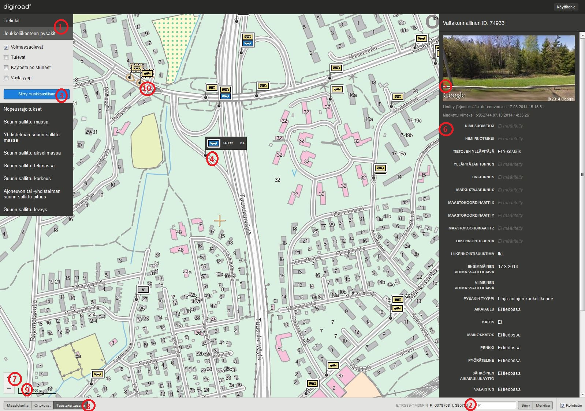
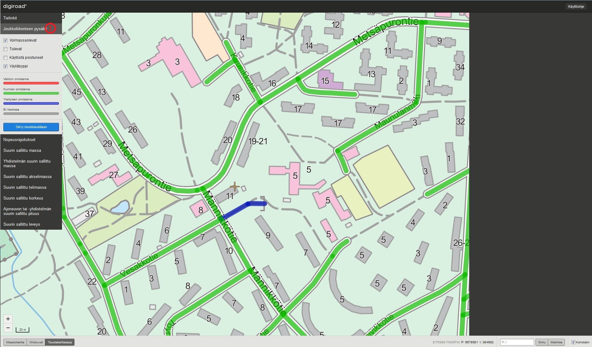
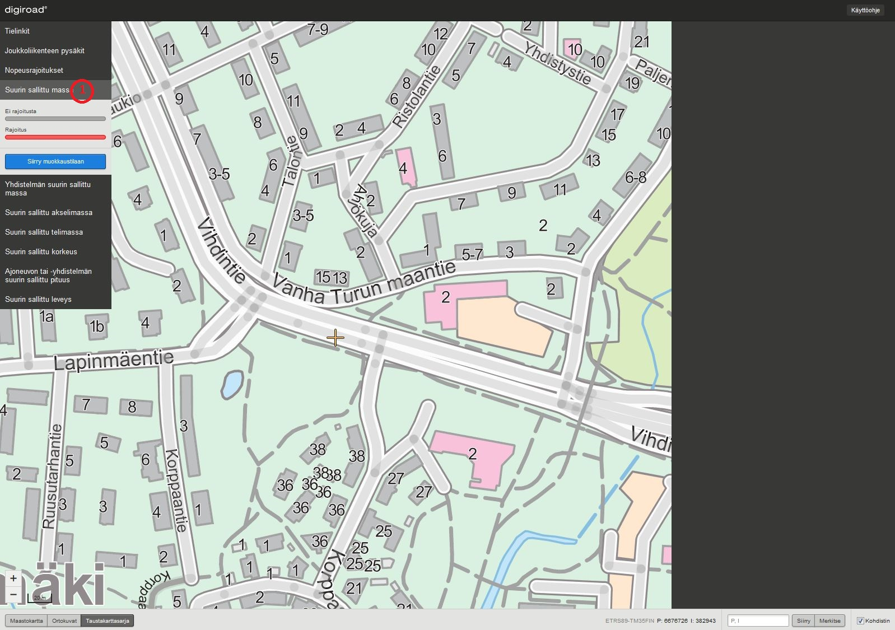
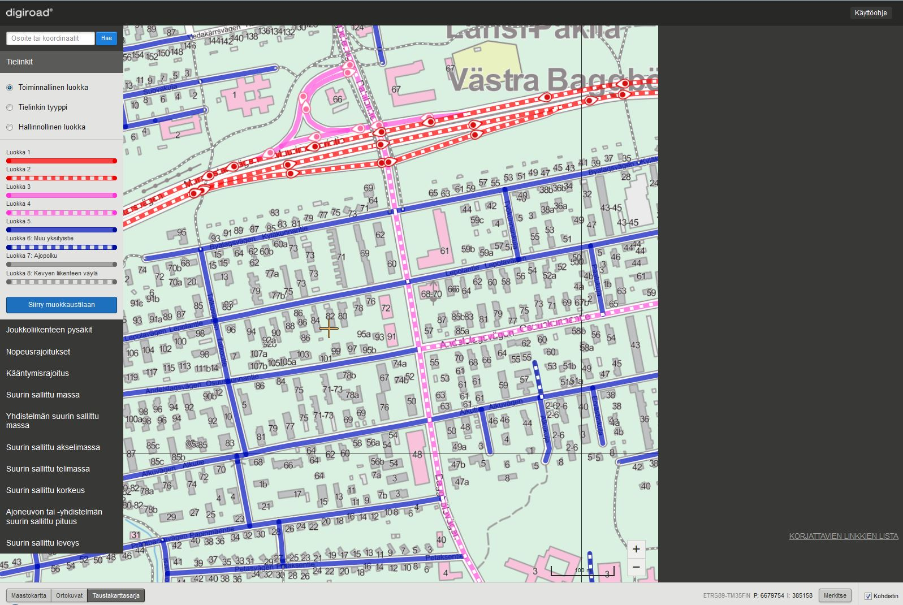
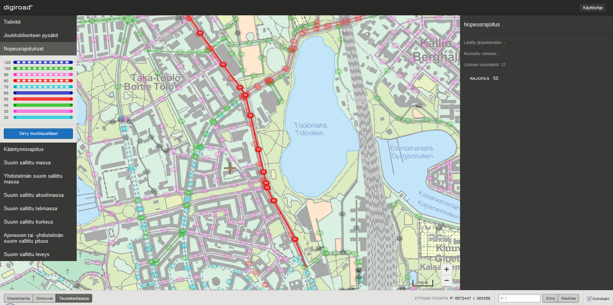
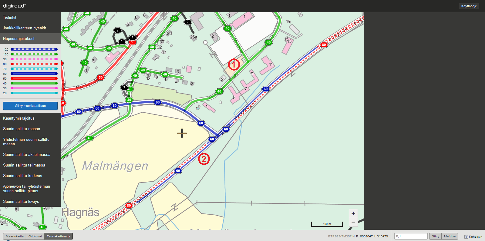
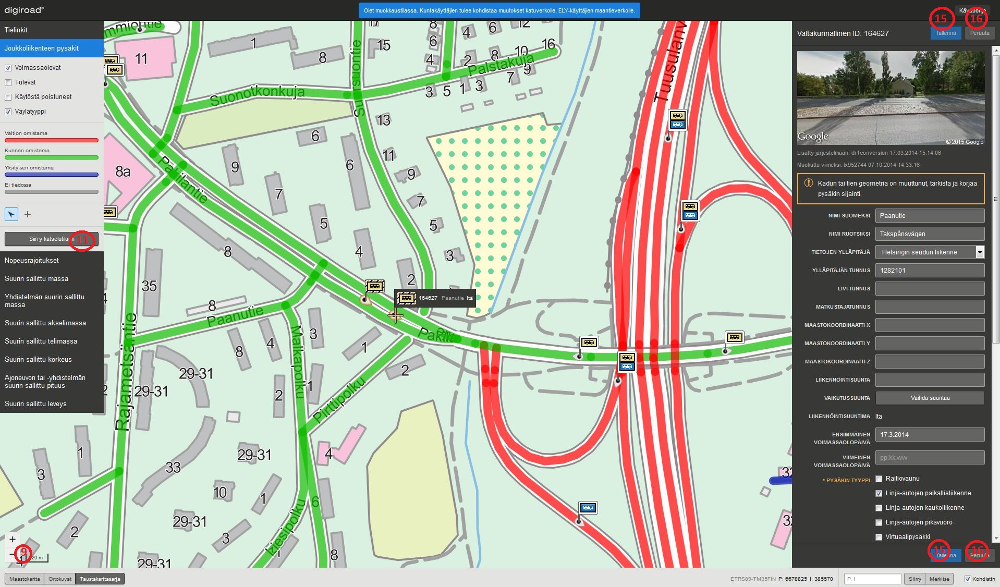
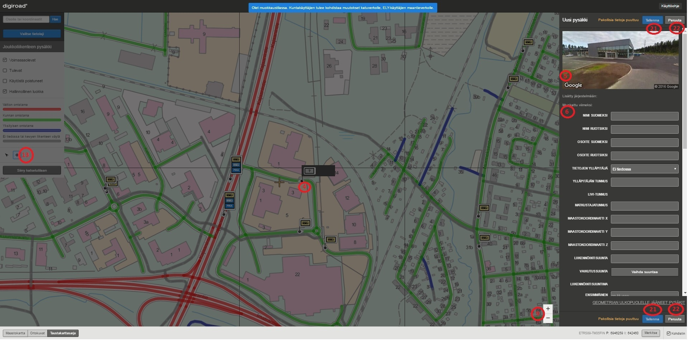
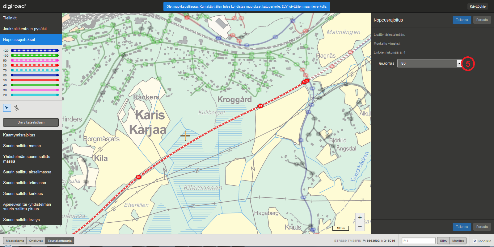
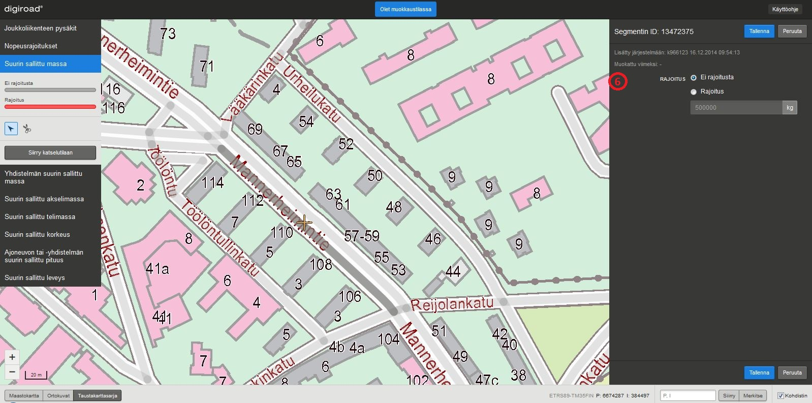

Loppuk&auml;ytt&auml;j&auml;n manuaali
==============================================

__Huom! Suosittelemme Firefoxia tai Chromea, kun sovelluksella yll&auml;pidet&auml;&auml;n DR2-tietoja.__

###Katselutila - muokkaajan roolissa###



_Katselutila._

1. Tietolajit -paletti
1. Koordinaattihaku
1. "Siirry muokkaustilaan"-painike
1. Valittu kohde
1. Google Street View
1. Ominaisuustieto -n&auml;kym&auml;
1. Mittakaavapainike
1. Taustakartat
1. Mittakaava
1. Pisara

###Katselutila - katselijan roolissa###


_Katselijan roolissa karttak&auml;ytt&ouml;liittym&auml;ss&auml; ei ole "Siirry muokkaustilaan"-painiketta._

###Muokkaustila###


_Muokkaustila._

11."Siirry katselutilaan"-painike
12.Ty&ouml;kalu 1
13.Ty&ouml;kalu 2
14.Muokkaustilan tunnusteksti
15.Tallenna-painike
16.Peruuta-painike

1. Miten p&auml;&auml;st&auml; alkuun?
-----------------------

1. Digiroadiin k&auml;yv&auml;t olemassa olevat Liikenneviraston tunnukset. Mik&auml;li tunnuksia ei ole, ne saa Digiroad-palvelusta: info@digiroad.fi tai 040-507 2301.

1. Digiroad-selainsovellukseen kirjaudutaan osoitteessa: https://testiextranet.liikennevirasto.fi/digiroad/.

1. Kirjautumisen j&auml;lkeen avautuu karttak&auml;ytt&ouml;liittym&auml;ss&auml; katselutila alueelta, johon k&auml;ytt&auml;j&auml;ll&auml; on oikeudet. Oikeudet on rajattu maantieteellisesti sek&auml; k&auml;ytt&auml;j&auml;n roolin mukaan. K&auml;ytt&auml;j&auml;n rooli on joko katselija tai muokkaaja. Katselijan roolissa aineistoja voi ainoastaan katsella. Muokkaajan roolissa aineistoja voi sek&auml; katsella ett&auml; muokata.


Oikeudet jakautuvat maantieteellisesti seuraavasti:

- Ilman varsinaisia digiroad-oikeuksia, liikenneviraston tunnuksilla p&auml;&auml;see katselemaan kaikkia aineistoja.
- Perusk&auml;ytt&auml;j&auml;ll&auml; on oikeudet h&auml;nelle m&auml;&auml;riteltyjen kuntien maantieteellisten kuntarojen sis&auml;puolella oleviin pys&auml;kkiaineistoihin.
- Premium-k&auml;ytt&auml;j&auml;ll&auml; on oikeudet h&auml;nelle m&auml;&auml;riteltyjen kuntien maantieteellisten kuntarojen sis&auml;puolella oleviin kaikkiin aineistoihin.
- DR-operaattorilla on oikeudet koko Suomen kaikkiin aineistoihin.

Jos kirjautumisen j&auml;lkeen ei avaudu karttak&auml;ytt&ouml;liittym&auml;n katselutilaa, ei kirjautuneelle henkil&ouml;lle ole luotu Digiroad-oikeuksia. T&auml;ll&ouml;in tulee ottaa yhteytt&auml; Digiroad-palveluun: info@digiroad.fi tai 040-507 2301.

1.1 Mist&auml; saada opastusta?
--------------------------

Digiroad-palvelusta saa tarvittavia tunnuksia ja k&auml;ytt&ouml;oikeuksia selainsovellukseen. Palvelu auttaa my&ouml;s ongelmatilanteissa sovelluksen k&auml;yt&ouml;n kanssa.

Yhteystiedot:

Digiroad-palvelu:
info@digiroad.fi
p. 040-507 2301
http://www.digiroad.fi/

Pys&auml;kkeihin liittyv&auml;t asiat:
pysakit@digiroad.fi

1.2 Usein kysytyt kysymykset ja ongelmatilanteet
------------------------------------------------

Digiroad 2 -sovelluksen k&auml;yt&ouml;n usein kysytyt kysymykset on koottu Digiroad-sivustolle. Usein kysyttyihin kysymyksiin p&auml;&auml;set [t&auml;&auml;lt&auml;.](http://www.digiroad.fi/yllapito/fi_FI/pysakkiohjeet/ )

####Ongelmatilanteet#####

Sovelluksen toimiessa virheellisesti (esim. kaikki aineistot eiv&auml;t lataudu oikein) toimi seuraavasti:

1. Lataa sivu uudelleen n&auml;pp&auml;imist&ouml;n F5-painikkeella.
2. Jos sivun lataaminen uudelleen ei korjaa ongelmaa, ota yhteytt&auml; DR2-operaattoriin: info@digiroad.fi 

2. Kirjautuminen Digiroad-sovellukseen
--------------------------------------

Digiroad-selainsovellukseen kirjaudutaan osoitteessa: https://testiextranet.liikennevirasto.fi/digiroad/. Kirjautumiseen tarvitaan voimassa olevat Liikenneviraston tunnukset. Tunnuksia saa Digiroad-palvelusta (kts. [Miten p&auml;&auml;st&auml; alkuun](#1._Miten_p&auml;&auml;st&auml;_alkuun?)).


_Kirjautuminen Digiroadiin._

Kirjautumisen j&auml;lkeen avautuu Digiroad-selainsovelluksen karttak&auml;ytt&ouml;liittym&auml;n katselutila. Maantieteellisesti kartalla on n&auml;kyviss&auml; alue, johon k&auml;ytt&auml;j&auml;ll&auml; on oikeudet (kts. [Miten p&auml;&auml;st&auml; alkuun](#1._Miten_p&auml;&auml;st&auml;_alkuun?)).


_Karttak&auml;ytt&ouml;liittym&auml;n katselutila._

Mik&auml;li kirjautumisen j&auml;lkeen ei avaudu karttak&auml;ytt&ouml;liittym&auml;n katselutilaa, ei k&auml;ytt&auml;j&auml;ll&auml; ole oikeuksia Digiroad-sovellukseen. Digiroad-oikeuksia voi pyyt&auml;&auml; digiroad-palvelusta (kts. [Miten p&auml;&auml;st&auml; alkuun](#1._Miten_p&auml;&auml;st&auml;_alkuun?)).

3. Yleist&auml;
----------

Sovelluksella on kaksi tilaa: katselu- ja muokkaustila. Jos k&auml;ytt&auml;j&auml;n rooli on katselija, h&auml;n p&auml;&auml;see vain katselutilaan. Muokkaajan roolissa oleva k&auml;ytt&auml;j&auml; p&auml;&auml;see sek&auml; katselu- ett&auml; muokkaustilaan. Kirjautumisen j&auml;lkeen avautuu katselutila, jossa voi ainoastaan katsella eri tietolajeja, esimerkiksi pys&auml;kkej&auml; tai nopeusrajoituksia. Tietolajien muokkaus suoritetaan muokkaustilassa. Molemmissa tiloissa n&auml;kyv&auml;t ainoastaan ne tietolajit, joihin k&auml;ytt&auml;j&auml;ll&auml; on oikeudet (kts. [Miten p&auml;&auml;st&auml; alkuun](#1._Miten_p&auml;&auml;st&auml;_alkuun?)). Kartalle voi valita yhden tietolajin kerrallaan, esimerkiksi pys&auml;kit. Tietolaji valitaan sivun vasemman tietolajit-paletista (1).

Muokkaustilan saa aktivoitua tietolajikohtaisesti klikkaamalla "Siirry muokkaustilaan"-painiketta (3). Muokkaustilassa kartan yl&auml;osassa on teksti "Olet muokkaustilassa. Kuntak&auml;ytt&auml;jien tulee kohdistaa muutokset katuverkolle, ELY-k&auml;ytt&auml;jien maantieverkolle.S" (14). Muokkaustilassa tehdyt muutokset tallentuvat painamalla "Tallenna"-painiketta (15) ja peruuntuvat painamalla "Peruuta"-painiketta (16). Takaisin katselutilaan p&auml;&auml;see klikkaamalla "Siirry katselutilaan"-painiketta (11).

Kaikki tietolajit n&auml;kyv&auml;t sek&auml; katselu- ett&auml; muokkaustilassa vain, kun kartan mittakaava on 1:20 000 tai tarkempi. Sovellus ilmoittaa, kun kartan mittakaava on liian ep&auml;tarkka tietolajin n&auml;kymiselle.


_Katselutila._


_Muokkaustila._

3.1 Karttan&auml;kym&auml;n muokkaus
--------------------------

####Kartan liikutus####

Karttaa liikutetaan raahaamalla.

####Mittakaavataso####

Kartan mittakaavatasoa muutetaan joko hiiren rullalla, tuplaklikkaamalla, Shift+piirto (alue) tai mittakaavapainikkeista  (7). Mittakaavapainikkeita k&auml;ytt&auml;m&auml;ll&auml; kartan keskitys s&auml;ilyy. Hiiren rullalla, tuplaklikkaamalla tai Shift+piirto (alue) kartan keskitys siirtyy kursorin kohtaan.  K&auml;yt&ouml;ss&auml; oleva mittakaavataso n&auml;kyy kartan vasemmassa alakulmassa (9).

####Koordinaattihaku####

K&auml;ytt&ouml;liittym&auml;ss&auml; on koordinaattihaku (2), joka keskitt&auml;&auml; kartan keskipisteen haettuun pisteeseen. Keskipiste on merkitty kartalle ristin&auml;. Siirry-painike keskitt&auml;&auml; kartan haettuun pisteeseen ja Merkitse-painike luo markerin haettuun pisteeseen. Markeri j&auml;&auml; kartalle, kunnes sille hakee uuden sijainnin. Ristin saa pois n&auml;kyvist&auml; klikkaamalla "N&auml;yt&auml; kohdistin"-valinnan tyhj&auml;ksi. Sy&ouml;tekentt&auml;&auml;n kirjoitetaan kokonaislukuina metrin tarkkuudella pohjois-koordinaatti (7 merkki&auml;) ja it&auml;-koordinaatti (6 merkki&auml;) ETRS35FIN-koordinaattij&auml;rjestelm&auml;ss&auml;. Koordinaatit erotetaan toisistaan pilkulla. Esimerkiksi:

```
6901839,435323
```

Koordinaattihakuun voi sy&ouml;tt&auml;&auml; vain koordinaatteja, jotka osuvat sovelluksen kartalle. Jos koordinaatit eiv&auml;t osu kartalle, sovellus ilmoittaa "Koordinaatit eiv&auml;t osu kartalle". My&ouml;sk&auml;&auml;n kirjaimia tai merkkej&auml; ei voi sy&ouml;tt&auml;&auml;. Jos sy&ouml;te on virheellinen merkkijono, sovellus ilmoittaa "K&auml;yt&auml; koordinaateissa P ja I numeroarvoja".
####Taustakartat####

Taustakartaksi voi valita maastokartan, ortokuvat tai taustakarttasarjan. (8)


_Karttan&auml;kym&auml;n muokkaus._

3.2 Tielinkit
-------------

Karttan&auml;kym&auml;&auml;n voi valita tielinkit valitsemalla tietolajit-paletista (1) Tielinkit. 


_Tielinkit._

3.2.1 Tielinkkien haku
----------------------

Tielinkkej&auml; haetaan tielinkin MML-ID:ll&auml; yksil&ouml;idyll&auml; URL-osoitteella. Esimerkki URL-osoitteesta:

https://devtest.liikennevirasto.fi/digiroad/#linkProperties/373320541

miss&auml; numerosarja 373320541 on tielinkin MML-ID. Toiminto tarkentaa karttak&auml;tt&ouml;liittym&auml;n haetun tielinkin kohdalle. Tielinkin ominaisuustieton&auml;kym&auml; aukeaa sivun oikealle puolelle.

3.3 Joukkoliikenteen pys&auml;kit
--------------------------------------

Karttan&auml;kym&auml;&auml;n voi valita pys&auml;kkej&auml; valitsemalla tietolajit-paletista (1) Joukkoliikenteen pys&auml;kit. Pys&auml;kkej&auml; valitaan pys&auml;kin voimassaolon mukaan: voimassa olevat, tulevat ja/tai k&auml;yt&ouml;st&auml; poistuneet. Valitseminen toimii samalla tavalla sek&auml; katselu- ett&auml; muokkaustilassa.

Tielinkeill&auml; on pys&auml;kkin&auml;kym&auml;ss&auml; oletuksena v&auml;rill&auml; korostettu Hallinnollinen luokka -valinta p&auml;&auml;ll&auml;. Valinnan saa pois klikkamalla tietolajit-valikon (1) "Joukkoliikenteen pys&auml;kit" kohdasta Hallinnollinen luokka-valinnan pois. Sininen v&auml;ri tarkoittaa yksityisen omistamaa tielinkki&auml;, vihre&auml; kunnan omistamaa ja punainen valtion omistamaa. Harmaalla korostettujen tielinkkien omistaja ei ole tiedossa. 



_Joukkoliikenteen pys&auml;kkien valinta._

####Kelluvat pys&auml;kit####

Joukkoliikenteen pys&auml;kki voi olla kelluva, jos tielinkkigeometria sen alla on muuttunut niin paljon, ettei j&auml;rjestelm&auml; pysty en&auml;&auml; p&auml;&auml;ttelem&auml;&auml;n sen sijaintia geometrialla. Kelluvat pys&auml;kit on korostettu karttan&auml;kym&auml;ss&auml; alla olevan kuvan tavoin, ja niiden ominaisuustieton&auml;kym&auml;ss&auml; on huomautus, että pys&auml;kki tulisi siirt&auml;&auml; tielinkille, jotta kelluvuus poistuu (kts. [Pys&auml;kin siirt&auml;minen](#5.1.2_Pys&auml;kin_siirt&auml;minen)). 


_Kelluvat pys&auml;kit on visualisoitu eri tavoin._

Kelluvista pys&auml;keist&auml; on lista [t&auml;&auml;ll&auml;.](https://testiextranet.liikennevirasto.fi/digiroad/floatingstops.html) Kelluvasta pys&auml;kist&auml; on listassa linkki, josta p&auml;&auml;see suoraan pys&auml;kin kohdalle sovelluksessa ja sen voi siirt&auml;&auml; takaisin geometrialle.


_Kelluvien pys&auml;kkien lista._

3.3.1 Joukkoliikenteen pys&auml;kkien haku
-------------------------------------

Joukkoliikenteen pys&auml;kkej&auml; haetaan pys&auml;kin kansallisella ID:ll&auml; yksil&ouml;idyll&auml; URL-osoitteella. Sovelluksen t&auml;ytyy olla pys&auml;kkin&auml;kym&auml;ss&auml; pys&auml;kki&auml; haettaessa. Esimerkki URL-osoitteesta:

https://testiextranet.liikennevirasto.fi/digiroad/#/asset/95374  (17)

miss&auml; numerosarja 95374 on pys&auml;kin kansallinen ID. Toiminto tarkentaa karttak&auml;ytt&ouml;liittym&auml;n katselutilan haetun pys&auml;kin kohdalle. Pys&auml;kin ominaisuustieton&auml;kym&auml; (6) aukeaa sivun oikealle puolelle. 


_Joukkoliikenteen pys&auml;kkien haku._

3.4 Nopeusrajoitukset
-----------------------------

Karttan&auml;kym&auml;&auml;n voi valita nopeusrajoitukset valitsemalla tietolajit-paletista (1) Nopeusrajoitukset. Karttaa tarkennettaessa nopeusrajoitukset paksuuntuvat, jotta niiden erottaminen on helpompaa. Nopeusrajoituksilla on nopeusrajoitusl&auml;tk&auml;, joka kertoo nopeusrajoituksen arvon ja linkit on visualisoitu eri v&auml;rein nopeusrajoituksen arvon mukaan. V&auml;rikoodien selitteet n&auml;kyv&auml;t Nopeusrajoitukset-valinnan alla, kun valitsee Nopeusrajoitukset.

Jos tielinkill&auml; ei ole nopeusrajoitusta, sovellus generoi sen itse siten, ett&auml; katujen nopeusrajoitus on 50km/h ja maanteiden sek&auml; yksityisteiden 80km/h. Nopeusrajoitus tulee n&auml;kyviin, kun sovellus on generoinut sen.


_Nopeusrajoitusten valinta._

3.5 K&auml;&auml;ntymisrajoitus
--------------------------------

Kartalle voi valita k&auml;&auml;ntymisrajoitukset valitsemalla tietolajit-paletista (1) K&auml;&auml;ntymisrajoitus. Karttaa tarkennettaessa k&auml;&auml;ntymisrajoitukset paksuuntuvat, jotta niiden erottaminen olisi helpompaa. K&auml;&auml;ntymisrajoitukset on visualisoitu siten, ett&auml; linkki, jolta ei saa k&auml;&auml;nty&auml;, on sininen, ja linkki, jolle ei saa k&auml;&auml;nty&auml; on visualisoitu punaisella katkoviivalla. Visualisoinnin selitteet n&auml;kyv&auml;t K&auml;&auml;ntymisrajoitus-valinnan alla tietolajit-paletissa.


_K&auml;&auml;ntymisrajoitusten valinta._

3.6 Suurin sallittu -valinta
------------------------------------

Kartalle voi valita tietolajit-paletista (1) Suurin sallittu -valinnan. Karttaa tarkennettaessa geometriat paksuuntuvat, jotta niiden erottaminen on helpompaa. Geometriat on visualisoitu punaisella v&auml;rill&auml; ja tielinkit, joilla suurinta sallittua arvoa ei ole, on visualisoitu harmaalla v&auml;rill&auml;.

Suurin sallittu -valintoja ovat:

__Suurin sallittu massa__
__Yhdistelm&auml;n suurin sallittu massa__
__Suurin sallittu akselimassa__
__Suurin sallittu telimassa__
__Suurin sallittu korkeus__
__Ajoneuvon- tai yhdistelm&auml;n suurin sallittu pituus__
__Suurin sallittu leveys__



_Suurin sallittu -valinta._

4. Katselutila
--------------

Katselutila on sovelluksen tietolajien katselemista varten. Katselutilassa ei voi muokata tietolajeja.

4.1 Tielinkin tietojen katselu
------------------------------

Yksitt&auml;isen tielinkin ominaisuustiedot tulevat n&auml;kyviin, kun tielinkin geometriaa kartalla klikataan (4). T&auml;ll&ouml;in tielinkin geometria korostuu kartalla ja sen ominaisuustiedot avautuvat ominaisuustieton&auml;kym&auml;&auml;n (6). Tielinkin ominaisuustietoja ovat tielinkin ID, Maanmittauslaitoksen ID (MML ID), hallinnollinen luokka, toiminnallinen luokka, liikennevirran suunta ja tielinkin tyyppi.

Tielinkeille voi valita visualisoinnin Tietolajit -paletista (1) tielinkkien alta. Visualisoinnin voi valita toiminnallisen luokan, tielinkin tyypin tai hallinnollisen luokan mukaan. Valinnan mukaan visualisoinnin selitteet n&auml;kyv&auml;t Tietolajit-paletissa. Lis&auml;ksi tielinkill&auml; on visualisoitu suuntanuoli, mik&auml;li tielinkin liikennevirran suunta on vain toiseen suuntaan.

Toiminnallisen luokan selitteet ovat:

Luokka 1: Ohjeellisesti valtatie tai seudullinen p&auml;&auml;katu
Luokka 2: Ohjeellisesti kantatie tai seudullinen p&auml;&auml;katu
Luokka 3: Ohjeellisesti seututie tai alueellinen p&auml;&auml;katu
Luokka 4: Ohjeellisesti yhdystie tai kokoojakatu
Luokka 5: Liitynt&auml;katu, t&auml;rke&auml; yksityistie
Luokka 6: Muu yksityistie
Luokka 7: Ajopolku
Luokka 8: Kevyen liikenteen v&auml;yl&auml;



_Tielinkit visualisoitu toiminnallisen luokan mukaan._


_Tielinkit visualisoitu tielinkin tyypin mukaan._


_Tielinkit visualisoitu hallinnollisen luokan mukaan._

4.2 Pys&auml;kin tietojen katselu
----------------------------

Yksitt&auml;isen pys&auml;kin ominaisuustiedot tulevat n&auml;kyviin, kun pys&auml;kki&auml; klikataan. T&auml;ll&ouml;in sivun oikeaan laitaan avautuu Google Street View (5) ja ominaisuustieto-n&auml;kym&auml; (6). Valitulle pys&auml;kille avautuu infokupla, jossa n&auml;kyy pys&auml;kin valtakunnallinen ID, suomenkielinen nimi, liikenn&ouml;intisuuntima ja pys&auml;kin tyyppi kuvana. (4)

Jos kaksi tai useampi pys&auml;kki ovat alle kuuden metrin p&auml;&auml;ss&auml; toisistaan, esitet&auml;&auml;n pys&auml;kit k&auml;ytt&ouml;liittym&auml;ss&auml; p&auml;&auml;llekk&auml;in ryhmiteltyn&auml;. P&auml;&auml;llekk&auml;in asettelu mahdollistaa pys&auml;kin tarkastelun ilman, ett&auml; samassa sijainnissa olevia pys&auml;kkej&auml; tarvitsee siirt&auml;&auml;. 

Ominaisuustieto-n&auml;kym&auml;ss&auml; kaikki kent&auml;t ovat disabloituja eli niit&auml; ei voi muokata. Google Street View -kuvaa klikkaamalla avautuu Google Street View uudelle v&auml;lilehdelle. Pys&auml;kin valinnan saa pois klikkaamalla karttaa.


_Joukkoliikenteen pys&auml;kin tietojen katselu._

4.3 Nopeusrajoituksen tietojen katselu
--------------------------------------

Yksitt&auml;isen nopeusrajoituksen voi valita klikkaamalla kartalta sen geometriaa. T&auml;ll&ouml;in valituksi tulevat kaikki nopeusrajoitukset, joilla on sama ID. Nopeusrajoitusketjun geometria tummentuu ja muut nopeusrajoitukset n&auml;kyv&auml;t haaleammalla. Sivun oikeaan laitaan avautuu nopeusrajoituksen ominaisuustieton&auml;kym&auml;.

Ominaisuustieton&auml;kym&auml;ss&auml; on nopeusrajoituksen ID ja arvo (km/h).



_Nopeusrajoituksen tietojen katselu._

Nopeusrajoitukset on visualisoitu eri tavoin riippuen vaikutussuunnasta. Nopeusrajoituksen vaikutussuunta voi olla molempiin suuntiin tai vain toiseen suuntaan. Jos vaikutussuunta on molempiin suuntiin, nopeusrajoitus on visualisoitu yhdellä paksulla viivalla (23). Yksisuuntainen vaikutus on visualisoitu ohuemmalla viivalla vaikutussuunnan mukaan tielinjan reunaan (24).



_Nopeusrajoitusten visualisointi._

4.4 k&auml;&auml;ntymisrajoituksen tietojen katselu
---------------------------------------------------

Yksitt&auml;isen k&auml;&auml;ntymisrajoituksen voi valita klikkaamalla kartalta sen geometriaa.  Valittu k&auml;&auml;ntymisrajoitus (4) korostuu kartalla ja sen ominaisuustiedot avautuvat ominaisuustieton&auml;kym&auml;&auml;n (6).


_K&auml;&auml;ntymisrajoituksen tietojen katselu._

4.5 Suurin sallittu -valinnan tietojen katselu
---------------------------------------------

Yksitt&auml;isen suurin sallittu -kohteen voi valita klikkaamalla kartalta sen geometriaa (4). Geometria tummentuu ja muut geometriat n&auml;kyv&auml;t haaleammalla. Sivun oikeaan laitaan avautuu valitun kohteen ominaisuustieton&auml;kym&auml; (6).


_Suurin sallittu -katsleutila._

5. Muokkaustila
---------------

Muokkaustila aktivoidaan painamalla "Siirry muokkaustilaan"-painiketta (3). Muokkaustila on eri tietolajien muokkaamista varten ja se on ulkoasultaan erilainen kuin katselutila. Kartan yl&auml;osassa on teksti: "Olet muokkaustilassa. Kuntak&auml;ytt&auml;jien tulee kohdistaa muutokset katuverkolle, ELY-k&auml;ytt&auml;jien maantieverkolle."

Muokkaustilasta p&auml;&auml;see takaisin katselutilaan klikkaamalla "Siirry katselutilaan" -painiketta (11).


_Muokkaustilaan p&auml;&auml;see klikkaamalla "Siirry muokkaustilaan"-painiketta (3)._



_Muokkaustilasta p&auml;&auml;see pois klikkaamalla "Siirry katselutilaan" -painiketta (11)._

Muokkaustilassa tietolajeihin tehdyt muutokset tallentuvat painamalla ominaisuustieton&auml;kym&auml;ss&auml; olevaa Tallenna-nappia (15). Muutosten tallentamisen j&auml;lkeen tietolajille tallentuu Muokattu viimeksi -kohtaan muokkaajan k&auml;ytt&auml;j&auml;tunnus, p&auml;iv&auml;m&auml;&auml;r&auml; ja kellonaika. Tehdyt muutokset peruuntuvat painamalla Peruuta-nappia (16). Tallenna- ja Peruuta -napit ovat disabloituja, kun muutoksia ei ole tehty. Jos muutoksia on tehnyt eik&auml; niit&auml; peru tai tallenna ja siirtyy muokkaamaan toista kohdetta tai pois auki olevan tietolajin muokkaustilasta, sovellus antaa muutos-dialogin, joka kertoo, ett&auml; muutoksia on tehty ja ne tulee tallentaa tai peruuttaa ennen kuin voi jatkaa. 

Jotta tietolajeja voi muokata, t&auml;ytyy kartan mittakaavan olla 1:20 000 tai tarkempi (9). Ep&auml;tarkemmilla zoomitasoilla sovellus antaa ilmoituksen:"Zoomaa l&auml;hemm&auml;ksi, jos haluat n&auml;hd&auml; kohteita."


_Muutos-dialogi._

5.1 Tielinkit
-------------

Tielinkki on tien, kadun, kevyen liikenteen v&auml;yl&auml;n tai lauttayhteyden keskilinjageometrian pienin yksikk&ouml;. Tielinkin ominaisuustiedot ovat aina voimassa koko tielinkin matkalla.

5.1.1 Tielinkin ominaisuustietojen muokkaus
-------------------------------------------

Yksitt&auml;isen tielinkin ominaisuustietoja voi muokata siirtym&auml;ll&auml; muokkaustilaan. Muokattava tielinkki valitaan hiirell&auml; klikkaamalla.

Tielinkin ominaisuustiedoista toiminnallinen luokka, liikennevirran suunta ja tielinkin tyyppi ovat muokattavissa.


_Tielinkin ominaisuustietojen muokkaus._

5.2 Joukkoliikenteen pys&auml;kit
----------------------------

Joukkoliikenteen pys&auml;kit ovat julkisen liikenteen k&auml;yt&ouml;ss&auml; olevia pys&auml;kkej&auml;: linja-autojen paikallisliikenteen, linja-autojen kaukoliikenteen, linja-autojen pikavuorojen ja raitiovaunujen pys&auml;kit sek&auml; virtuaalipys&auml;kit.

5.2.1 Joukkoliikenteen pys&auml;kin ominaisuustietojen muokkaus
--------------------------------------------------------
Yksitt&auml;isen pys&auml;kin ominaisuustietoja voi muokata valitsemalla muokkausty&ouml;kalun (12). Muokattava pys&auml;kki valitaan hiirell&auml; klikkaamalla. P&auml;&auml;llekk&auml;in esitetyist&auml; pys&auml;keist&auml; voi valita yhden pys&auml;kin klikkaamalla pys&auml;kki&auml;. Pinosta valitun pys&auml;kin erottaa sille avautuvasta kuplasta. Valittaessa pys&auml;kin sivun oikeaan laitaan avautuu Google Street View -n&auml;kym&auml; (5) pys&auml;kist&auml; sek&auml; pys&auml;kin ominaisuustiedot (6). Jos pysäkillä ei ole tyyppiä, tulee se asettaa ennen tallentamista. Pys&auml;kkien ominaisuustieton&auml;kym&auml;ss&auml; n&auml;kyy ilmoitus, jos pys&auml;kilt&auml; puuttuu pakollisia tietoja.

Pys&auml;kin valinnan saa pois klikkaamalla karttaa, kun tallennus tai peruutus on tehty.


_Joukkoliikenteen pys&auml;kin ominaisuustietojen muokkaus._

####Pys&auml;kin vaikutussuunnan muuttaminen####

Googlen Street View -n&auml;kym&auml; (5) sivun oikeassa laidassa on suunnattu suuntaan, jossa pys&auml;kin tallennetun vaikutussuunnan mukaan kuuluisi olla. Painamalla n&auml;kym&auml;&auml; avautuu Googlen Street View -v&auml;lilehti, jossa pys&auml;kin ymp&auml;rist&ouml;&auml; voi tarkastella tarkemmin. Kartalla pys&auml;kin vaikutussuunta n&auml;kyy pisarana pys&auml;kkikuvakkeella (10). Pisaran k&auml;rki osoittaa pys&auml;kin liikennevirran suuntaan.

Pys&auml;kin vaikutussuunnan voi muuttaa ominaisuustieton&auml;kym&auml;ss&auml; (6) painamalla "Vaihda suuntaa"-painiketta (18). Pys&auml;kin vaikutussuuntaa muutettaessa Googlen Street View -n&auml;kym&auml; (5) muuttuu vastaamaan uutta vaikutussuuntaa ja pisaran suunta k&auml;&auml;ntyy.


_Joukkoliikenteen pys&auml;kin vaikutussuunnan voi muuttaa painamalla "Vaihda suuntaa"-painiketta (18)._

####Pys&auml;kin voimassaolop&auml;ivien muokkaus####

Ensimm&auml;inen voimassaolop&auml;iv&auml; (19) tarkoittaa p&auml;iv&auml;m&auml;&auml;r&auml;&auml;, josta l&auml;htien pys&auml;kki on k&auml;yt&ouml;ss&auml;. Viimeinen voimassaolop&auml;iv&auml; (20) tarkoittaa p&auml;iv&auml;m&auml;&auml;r&auml;&auml;, jolloin pys&auml;kki on viimeisen kerran k&auml;yt&ouml;ss&auml;. Molempia p&auml;iv&auml;m&auml;&auml;ri&auml; voi muokata ominaisuustieto -n&auml;kym&auml;n (6) kautta. P&auml;iv&auml;m&auml;&auml;ri&auml; voi muokata joko kirjoittamalla ne p&auml;iv&auml;m&auml;&auml;r&auml;kentt&auml;&auml;n muodossa pp.kk.vvvv tai valitsemalla ne kalenterista, joka avautuu, kun p&auml;iv&auml;m&auml;&auml;r&auml;kentt&auml;&auml; klikkaa.

P&auml;iv&auml;m&auml;&auml;ri&auml; ei voi asettaa ristiin siten, ett&auml; "Ensimm&auml;inen voimassaolop&auml;iv&auml;" olisi my&ouml;hemmin kuin "Viimeinen voimassaolop&auml;iv&auml;". Kalenterissa ei-sallitut p&auml;iv&auml;m&auml;&auml;r&auml;t ovat disabloituja. Jos p&auml;iv&auml;m&auml;&auml;r&auml;kentt&auml;&auml;n kirjoittaa p&auml;iv&auml;m&auml;&auml;r&auml;n, joka asettaa p&auml;iv&auml;m&auml;&auml;r&auml;t ristiin, ei p&auml;iv&auml;m&auml;&auml;r&auml; tallennu.

Jos "Ensimm&auml;inen voimassaolop&auml;iv&auml;" tai "Viimeinen voimassaolop&auml;iv&auml;" ei ole tiedossa, voi kalenterista valita "ei tietoa".


_Pys&auml;kin voimassaolop&auml;ivien muokkaus._

####Pys&auml;kin muiden ominaisuustietojen muokkaus####

Muita ominaisuustietoja voi muokata oikeassa laidassa olevan ominaisuustieton&auml;kym&auml;n (6) kautta. Tietoja muokataan joko kirjoittamalla tietokentt&auml;&auml;n, valitsemalla pudotusvalikosta tieto tai merkitsem&auml;ll&auml; rasti ruutuun oikean/oikeiden tietojen kohdalle.


_Joukkoliikenteen pys&auml;kin ominaisuustietojen muokkaus._

####Ominaisuustiedot:####

__Sovellus generoi automaattisesti:__

__Lis&auml;tty j&auml;rjestelm&auml;&auml;n:__ Tiedon luojan k&auml;ytt&auml;j&auml;tunnus tai massaimportin l&auml;hde ja tiedon lis&auml;yshetki. 
__Muokattu viimeksi:__ Muokkaajan k&auml;ytt&auml;j&auml;tunnus ja tiedon muokkaushetki. 
__Liikenn&ouml;intisuuntima:__ Sovellus laskee itse tiegeometriasta. Pohjoinen on nolla astetta ja koko kierros my&ouml;t&auml;p&auml;iv&auml;&auml;n 360 astetta. Ilmoitetaan asteluvun mukaan pohjoinen, it&auml;, etel&auml; tai l&auml;nsi.

__K&auml;ytt&auml;j&auml; lis&auml;&auml; j&auml;rjestelm&auml;&auml;n:__

Ominaisuustietokent&auml;t ovat tekstikentti&auml;, joihin ominaisuustieto kirjoitetaan merkkijonona, monivalintoja, josta voi valita oikeat vaihtoehdot tai pudotusvalikkovalintoja, joista voi valita yhden vaihtoehdon.

__Nimi suomeksi:__ Pys&auml;kin nimi suomen kielell&auml;. Nimen tulee olla valtakunnallisesti yksil&ouml;iv&auml;. Esim. Ei "Linja-autoasema" vaan "Porvoon linja-autoasema".
__Nimi ruotsiksi:__ Pys&auml;kin nimi ruotsin kielell&auml;. 
__Tietojen yll&auml;pit&auml;j&auml;:__ Yll&auml;pit&auml;v&auml; viranomainen: kunta, Helsingin seudun liikenne tai ELY-keskus.
__Yll&auml;pit&auml;j&auml;n tunnus:__ Tietojen yll&auml;pit&auml;j&auml;n sis&auml;inen tunnus pys&auml;kille.
__LIVI-tunnus:__ Pys&auml;kin Livi-tunniste, vastaava tunnus kuin Tierekisteriss&auml;. K&auml;yt&ouml;ss&auml; vain maanteiden pys&auml;keill&auml;.
__Matkustajatunnus:__ Pys&auml;kin tunnus, joka n&auml;kyy matkustajalle.
__Maastokoordinaatti X:__ Pys&auml;kin sijainnin mitattu X-koordinaatti: EUREF FIN ETRS89-TM35FIN.
__Maastokoordinaatti Y:__ Pys&auml;kin sijainnin mitattu Y-koordinaatti: EUREF FIN ETRS89-TM35FIN.
__Maastokoordinaatti Z:__ Pys&auml;kin sijainnin mitattu Z-koordinaatti: N2000 korkeusj&auml;rjestelm&auml;ss&auml;.
__Liikenn&ouml;intisuunta:__ Pys&auml;kin suunta sanallisesti kuvattuna. Esimerkiksi:"Keskustaan".
__Vaikutussuunta:__ Vaikutussuunta on visualisoitu pys&auml;kin liikennevirran suunnaksi pisaralla (9). Google Street View (4) osoittaa suuntaan, jossa pys&auml;kin kuuluisi olla.
__Ensimm&auml;inen voimassaolop&auml;iv&auml;:__ P&auml;iv&auml;m&auml;&auml;r&auml;, jolloin pys&auml;kki on ensimm&auml;isen kerran k&auml;yt&ouml;ss&auml;.
__Viimeinen voimassaolop&auml;iv&auml;:__ P&auml;iv&auml;m&auml;&auml;r&auml;, jolloin pys&auml;kki on viimeisen kerran k&auml;yt&ouml;ss&auml;.
__Pys&auml;kin tyyppi: Pakollinen tieto!__ Linja-autojen paikallisliikenne, raitiovaunu, linja-autojen kaukoliikenne, linja-autojen pikavuoro tai virtuaalipys&auml;kki.
__Aikataulu:__ Paperinen, pys&auml;kin sein&auml;&auml;n tai tolppaan aikataulukehikkoon kiinnitetty aikataulu, joka sis&auml;lt&auml;&auml; tiedot pys&auml;kill&auml; liikenn&ouml;ivien reittien l&auml;ht&ouml;ajoista sek&auml; mahdollisesti my&ouml;s pys&auml;kkikohtaisista ohitusajoista. Mahdolliset arvot: kyll&auml;, ei tai ei tietoa. Oletuksena on "ei tietoa".
__Katos:__  Pys&auml;kkialueella sijaitseva, joukkoliikennev&auml;linett&auml; odottaville matkustajille tarkoitettu s&auml;&auml;lt&auml; suojaava katos. Mahdolliset arvot: kyll&auml;, ei tai ei tietoa. Oletuksena on "ei tietoa".
__Mainoskatos:__  Pys&auml;kkialueella sijaitseva, joukkoliikennev&auml;linett&auml; odottaville matkustajille tarkoitettu s&auml;&auml;lt&auml; suojaava katos, joka sis&auml;lt&auml;&auml; mainoksia. Pys&auml;kin kunnossapidosta vastaa t&auml;ll&ouml;in mainosten yll&auml;pit&auml;j&auml;. Mahdolliset arvot: kyll&auml;, ei tai ei tietoa. Oletuksena on "ei tietoa".
__Penkki:__ Pys&auml;kkialueella sijaitseva, joukkoliikennett&auml; odottavilla matkustajille tarkoitettu penkki, joka sijaitsee yleisimmin pys&auml;kkikatoksen alla. Mahdolliset arvot: kyll&auml;, ei tai ei tietoa. Oletuksena on "ei tietoa".
__Py&ouml;r&auml;teline:__ Kyll&auml;, ei tai ei tietoa. Oletuksena on "ei tietoa".
__S&auml;hk&ouml;inen aikataulun&auml;ytt&ouml;:__ Pys&auml;kkialueelta l&ouml;ytyv&auml; s&auml;hk&ouml;inen aikataulun&auml;ytt&ouml;, joka tuottaa reaaliaikaisen informaation pys&auml;kill&auml; kulkevasta liikenteest&auml;. Mahdolliset arvot: kyll&auml;, ei tai ei tietoa. Oletuksena on "ei tietoa".
__Valaistus:__ Pys&auml;kin valaistuksella tarkoitetaan yleisimmin pys&auml;kin kattoon upotettuja valoelementtej&auml;, jotka tuottavat valaistuksen pys&auml;kkikatoksen sis&auml;lle. Mahdolliset arvot: kyll&auml;, ei tai ei tietoa. Oletuksena on "ei tietoa".
__Esteett&ouml;myys liikuntarajoitteiselle:__ Pys&auml;kki on esteet&ouml;n, mik&auml;li se mahdollistaa itsen&auml;isen, esteett&ouml;m&auml;n matkustamisen ja odottelun my&ouml;s erityisryhmille, esim. py&ouml;r&auml;tuolilla liikkuville. Pys&auml;kin esteett&ouml;myyteen vaikuttavat pys&auml;kki- ja laiturirakenteiden, asema- ja terminaalirakenteiden sek&auml; aikatauluinformaation esteett&ouml;myys. Oletuksena on "ei tiedossa".
__Saattomahdollisuus henkil&ouml;autolla:__ Ilmaisee, mik&auml;li (valtatien varrella olevaa) pys&auml;ki&auml; varten on rakennettu erillinen matkustajien nouto/saatto-alue. Mahdolliset arvot: kyll&auml;, ei tai ei tietoa. Oletuksena on "ei tietoa".
__Liitynt&auml;pys&auml;k&ouml;intipaikkojen m&auml;&auml;r&auml;:__ Keskusta-alueen ulkopuolella olevan pys&auml;kki- tai terminaalialueen l&auml;heisyydess&auml; sijaitsevien, auton pys&auml;k&ouml;imist&auml; varten varattujen parkkipaikkojen m&auml;&auml;r&auml;. Kentt&auml; j&auml;tet&auml;&auml;n tyhj&auml;ksi, mik&auml;li liitynt&auml;pys&auml;k&ouml;intipaikkoja ei ole. Mik&auml;li liitynt&auml;pys&auml;k&ouml;intipaikat palvelevat useampaa pys&auml;kki&auml;, t&auml;ytet&auml;&auml;n tiedot liitynt&auml;pys&auml;k&ouml;innist&auml; erikseen kullekin pys&auml;kille.
__Liitynt&auml;pys&auml;k&ouml;innin lis&auml;tiedot:__ Pys&auml;kin yhteydess&auml; olevien liitynt&auml;pys&auml;k&ouml;intipaikkojen lis&auml;tiedot.
__Pys&auml;kin omistaja:__ Kunta, Helsingin seudun liikenne, ELY-keskus tai Liikennevirasto. Erikoistapauksia varten (esim. uudenmaan ELY).
__Palauteosoite:__ Osoite, johon pys&auml;kist&auml; voi laittaa palautetta. Esimerkiksi s&auml;hk&ouml;postiosoite.
__Lis&auml;tiedot:__ Julkiset kommentit. Esimerkiksi: "Alueella tiet&ouml;it&auml;".

5.2.2 Pys&auml;kin siirt&auml;minen
-----------------------

Pys&auml;kki&auml; siirret&auml;&auml;n k&auml;ytt&auml;m&auml;ll&auml; muokkausty&ouml;kalua (12). Pys&auml;kkej&auml; voi siirt&auml;&auml; vain tarpeeksi tarkalta mittakaavatasolta, joka on 1:10 000 tai tarkempi (9).

Siirt&auml;minen tapahtuu tarttumalla pys&auml;kkiin kiinni ja raahaamalla se oikeaan paikkaan. Pys&auml;kki l&auml;htee liikkeelle, kun siit&auml; on pidetty kiinni 0,1 sekuntia. Pys&auml;kki liikkuu vain olemassa olevia tielinkkej&auml; (ei tielinkeill&auml;, jotka ovat kevyen liikenteen v&auml;yli&auml; tai lautta/lossi v&auml;yli&auml;) pitkin ja k&auml;ytt&auml;j&auml;n p&auml;ivitysoikeuksien sallimien maantieteellisten rajojen sis&auml;puolella. Jos pys&auml;kin irrottaa tielinkist&auml;, kiinnittyy se automaattisesti l&auml;himp&auml;&auml;n tielinkkiin, joka on k&auml;ytt&auml;j&auml;n p&auml;ivitysoikeuksien sallimalla maantietellisell&auml; alueella. Jos riitt&auml;v&auml;n l&auml;hell&auml;  ei ole toista tielinkki&auml;, ei pys&auml;kki irtoa linkilt&auml;, jolla se on. Tielinkki, jonka p&auml;&auml;ll&auml; pys&auml;kki on, n&auml;kyy sinisell&auml; korostusv&auml;rill&auml;. Kun pys&auml;kist&auml; p&auml;&auml;stet&auml;&auml;n irti (lasketaan se uuteen sijaintiin), oikealle avautuu Google Street View (5) ja ominaisuustieto -n&auml;kym&auml; (6), jonka kautta voi halutessaan muokata muita ominaisuustietoja. Pys&auml;kin siirt&auml;minen ei muuta pys&auml;kin mitattuja maastokoordinaatteja vaan ne s&auml;ilyv&auml;t ennallaan. Pys&auml;kin uusi sijainti tallettuu painamalla Tallenna-painiketta (15). Painamalla Peruuta-painiketta (16) pys&auml;kki palautuu alkuper&auml;iselle paikalleen. Jos pys&auml;kilt&auml; puuttuu tyyppi, tulee se t&auml;ydent&auml;&auml; ennen tallentamista. Pys&auml;kkien ominaisustieton&auml;kym&auml;ss&auml; n&auml;kyy ilmoitus, jos pys&auml;kilt&auml; puuttuu pakollisia tietoja.

Siirrett&auml;ess&auml; pys&auml;kki&auml;, joka on pinossa, j&auml;&auml; pinoon siirrett&auml;v&auml;n pys&auml;kin kohdalle rako, kunnes siirron tallentaa tai peruuttaa. Jos pys&auml;kin siirt&auml;&auml; alle kuuden metrin p&auml;&auml;h&auml;n toisesta/toisista pys&auml;keist&auml;, siirtyy pysäkki osaksi pinoa.

Pys&auml;kin siirto t&auml;ytyy tallentaa tai peruuttaa ennen kuin voi siirty&auml; muokkaamaan muita pys&auml;kkej&auml; tai pois muokkaustilasta. Sovellus ilmoittaa tehdyst&auml; muutoksesta muutos-dialogilla.


_Joukkoliikenteen pys&auml;kin siirt&auml;minen._

5.2.3 Uuden pys&auml;kin lis&auml;&auml;minen
----------------------------

Uusia pys&auml;kkej&auml; voi lis&auml;t&auml;, kun mittakaavataso on 1:10 000 tai tarkempi. T&auml;m&auml; mittakaavataso on yht&auml; tasoa tarkempi kuin uloin mittakaavataso jolla pys&auml;kit n&auml;ytet&auml;&auml;n. Uusi pys&auml;kki luodaan klikkaamalla kartan tiest&ouml;st&auml; haluttu sijainti pys&auml;kille lis&auml;ysty&ouml;kalulla (13). Jos valitulla kohdalla ei ole tielinkki&auml;, muodostuu pys&auml;kki l&auml;himm&auml;lle tielinkille. Jos pys&auml;kin yritt&auml;&auml; luoda liian kauas l&auml;himm&auml;st&auml; tielinkist&auml;, ei pys&auml;kki&auml; muodostu. Uusi pys&auml;kki on korostettu sinisell&auml; v&auml;rill&auml; (4) ja sivun oikealle puolelle avautuu Google Street View (5) ja ominaisuustieton&auml;kym&auml; (6), jossa pys&auml;kille tallennetaan tiedossa olevat ominaisuustiedot.

Sovellus muodostaa osan ominaisuustiedoista itse, jos niit&auml; ei m&auml;&auml;ritet&auml;. "Ensimm&auml;inen voimassaolop&auml;iv&auml;" oletetaan meneill&auml;&auml;n olevaksi p&auml;iv&auml;m&auml;&auml;r&auml;ksi. Pys&auml;kin vaikutussuunta oletetaan alla olevan linkin digitointisuunnaksi. Kaikkien varusteiden oletusarvo on "Ei tietoa". Lis&auml;ksi valtakunnallinen tunnus muodostuu automaattisesti Digiroadin omasta numeroavaruudesta eik&auml; k&auml;ytt&auml;j&auml;n tarvitse sit&auml; itse asettaa.

Pys&auml;kin tyyppi on pakollinen tieto eik&auml; uutta pys&auml;kki&auml; voi tallentaa, jos sit&auml; ei ole m&auml;&auml;ritetty. Uuden pys&auml;kin ominaisuustieton&auml;kym&auml;ss&auml; n&auml;kyy ilmoitus, jos pys&auml;kin pakollisia tietoja puuttuu. Kun ominaisuustiedot on kirjattu, painetaan Tallenna-painiketta (21) tietojen tallentamiseksi tietokantaan. Jos pys&auml;kki&auml; ei halutakaan luoda, painetaan Peruuta-painiketta (22). Sovellus antaa muokata vain luotavan pys&auml;kin ominaisuustietoja niin kauan, kunnes on klikattu joko "Tallenna" tai "Peruuta".

Uuden pys&auml;kin voi lis&auml;t&auml; alle kuuden metrin p&auml;&auml;h&auml;n olemassa olevasta pys&auml;kist&auml;. 

Uuden pys&auml;kin lis&auml;&auml;misen vaiheet:

1. Aktivoi muokkaustila.
1. Etsi kartalta kohta, jonne haluat pys&auml;kin lis&auml;t&auml;.
1. Tarkenna mittakaava 1:10 000 tai tarkemmaksi (9).
1. Valitse lis&auml;ysty&ouml;kalu (13).
1. Klikkaa linkin kohtaa, johon haluat lis&auml;t&auml; pys&auml;kin.
1. Lis&auml;&auml; ominaisuustieto -n&auml;kym&auml;&auml;n (6) pakolliset ja olemassa olevat tiedot pys&auml;kist&auml;.
1. Jos et haluakaan luoda ko. pys&auml;kki&auml;, paina Peruuta-painiketta (22).
1. Kun olet lis&auml;nnyt haluamasi tiedot, paina Luopainiketta (21).



_Joukkoliikenteen pys&auml;kin lis&auml;&auml;minen._

5.2.4 Pys&auml;kin m&auml;&auml;ritt&auml;minen k&auml;yt&ouml;st&auml; poistuneeksi
------------------------------

Olemassa oleva pys&auml;kki m&auml;&auml;ritet&auml;&auml;n k&auml;yt&ouml;st&auml; poistuneeksi muokkausty&ouml;kalulla (12). Kartan mittakaavan tulee olla 1:20 000 tai tarkempi, jotta pys&auml;kin voi m&auml;&auml;ritt&auml;&auml; k&auml;yt&ouml;st&auml; poistuneeksi (9). K&auml;yt&ouml;st&auml; poistunut pys&auml;kki valitaan klikkaamalla pys&auml;kkikuvaketta, jolloin avautuu ominaisuustieton&auml;kym&auml; (6). Valittu pys&auml;kki korostuu sinisell&auml; huomiov&auml;rill&auml; (4). Pys&auml;kin k&auml;yt&ouml;st&auml; poistuneeksi m&auml;&auml;ritt&auml;minen suoritetaan asettamalla ominaisuustieton&auml;kym&auml;n (6) "Viimeinen voimassaolop&auml;iv&auml;" -kentt&auml;&auml;n (20) pys&auml;kin viimeinen voimassaolop&auml;iv&auml;m&auml;&auml;r&auml;. Pys&auml;kin tila muuttuu k&auml;yt&ouml;st&auml; poistuneeksi viimeist&auml; voimassaolop&auml;iv&auml;m&auml;&auml;r&auml;&auml; seuraavana p&auml;iv&auml;n&auml;. Pys&auml;kin poistamisen voi perua valitsemalla "Viimeinen voimassaolop&auml;iv&auml;" -kentt&auml;&auml;n "Ei tietoa" avautuvasta kalenterista tai pyyhkim&auml;ll&auml; kent&auml;n tyhj&auml;ksi. Jos pys&auml;kilt&auml; puuttuu tyyppi tai suomenkielinen nimi, tulee ne t&auml;ydent&auml;&auml; ennen tallentamista.

Jos pys&auml;kin viimeinen voimassaolop&auml;iv&auml; on menneisyydess&auml;, aktivoituu kartalla "K&auml;yt&ouml;st&auml; poistuneet" -pys&auml;kkivalinta. Pys&auml;kin kuvake h&auml;vi&auml;&auml; kartalta, kun "K&auml;yt&ouml;st&auml; poistuneet" -pys&auml;kkivalinnan sulkee.

Vanhan pys&auml;kin poistamisen vaiheet:

1. Aktivoi muokkaustila.
1. Etsi kartalta pys&auml;kki, jonka haluat poistaa.
1. Tarkenna kartan mittakaava 1:20 000 tai tarkemmaksi (9).
1. Valitse muokkausty&ouml;kalu (12).
1. Klikkaa pys&auml;kki&auml; (4).
1. Aseta pys&auml;kille "Viimeinen voimassaolop&auml;iv&auml;" -kentt&auml;&auml;n (20) viimeinen voimassaolop&auml;iv&auml;m&auml;&auml;r&auml; kirjoittamalla tai valitsemalla se kalenterista, joka avautuu klikkaamalla "Viimeinen voimassaolop&auml;iv&auml;" -kentt&auml;&auml;.
1. Jos et halua poistaa pys&auml;kki&auml;, valitse kalenterista "Ei tietoa".
1. Pys&auml;kin viimeinen voimassaolop&auml;iv&auml;m&auml;&auml;r&auml; tallentuu painamalla Tallenna-nappia (15).


_Joukkoliikenteen pys&auml;kin poistaminen._

5.3 Nopeusrajoitukset
---------------------

Nopeusrajoitus on liikennev&auml;yl&auml;lle asetettu ajoneuvon suurin sallittu nopeus.

5.3.1 Nopeusrajoituksen ominaisuustietojen muokkaus
--------------------------------------------------

Nopeusrajoituksen tietoja muokataan muokkaustilassa muokkausty&ouml;kalulla (12). Muokattava nopeusrajoitus (4) valitaan klikkaamalla sen geometriaa. Tietoja muokataan ominaisuustieton&auml;kym&auml;ss&auml; (6). Muutokset tallennetaan painamalla Tallenna-painiketta oikeasta alakulmasta (8). Ennen Tallenna-painikkeen painamista muutokset voi peruuttaa painamalla Peruuta-painiketta (9). Tallenna- ja peruuta –painikkeet eiv&auml;t ole aktiivisina, jos muutoksia ei ole tehty. Jos muutoksia on tehty eik&auml; niit&auml; ole peruttu tai tallennettu ja siirryt&auml;&auml;n muokkaamaan toista kohdetta tai pois auki olevan tietolajin muokkaustilasta, sovellus antaa muutos-dialogin, joka kertoo, ett&auml; muutoksia on tehty ja ne tulee tallentaa tai peruuttaa ennen kuin voi jatkaa.



_Nopeusrajoituksen ominaisuustietojen muokkaus._

####Yhden nopeusrajoituksen arvon muokkaus####

Uusi nopeusrajoituksen arvo valitaan Rajoitus-pudotusvalikosta. Valinnan yhteydess&auml; nopeusrajoituksen visualisointi muuttuu vastaamaan valitun nopeusrajoituksen arvoa.

####Useamman nopeusrajoituksen arvon muokkaus kerralla####

Useamman kuin yhden nopeusrajoituksen arvon voi muuttaa kerralla. Halutut nopeusrajoitukset valitaan painamalla Ctrl-painike n&auml;pp&auml;imist&ouml;lt&auml; pohjaan ja piirt&auml;m&auml;ll&auml; hiirell&auml; laatikko nopeusrajoitusten p&auml;&auml;lle. Valituksi tulevat kaikki nopeusrajoitukset laatikon sisällä ja nopeusrajoitukset, joita laatikko leikkaa. Valinnan j&auml;lkeen avautuu ikkuna, jossa valitaan nopeusrajoituksille tallentuva arvo ja painetaan tallenna. Peruuta-painikkeesta voi peruuttaa muutoksen.


_Useamman nopeusrajoituksen arvon muokkaus kerralla._

5.3.2 Nopeusrajoituksen katkaiseminen
-------------------------------------

Nopeusrajoituksen voi jakaa kahteen osaan leikkausty&ouml;kalulla (13). Leikkausty&ouml;kalulla klikataan nopeusrajoituksen geometriasta kohtaa, josta nopeusrajoitus halutaan katkaista. Nopeusrajoituksen geometrian p&auml;&auml;ll&auml; ty&ouml;kalu n&auml;kyy ristin&auml;, jotta tarkka katkaisukohta on helppo m&auml;&auml;ritt&auml;&auml;.


_Nopeusrajoituksen katkaiseminen._

Katkaistun nopeusrajoituksen osista pidemm&auml;lle j&auml;&auml; alkuper&auml;isen rajoituksen ID ja arvo. Lyhyempi osa tulee valituksi kartalla ja sen ominaisuustiedot avautuvat ominaisuustieton&auml;kym&auml;&auml;n. Rajoitus-pudotusvalikosta voi valita nopeusrajoitukselle uuden arvon. Oletusarvona on sama nopeusrajoituksen arvo kuin alkuper&auml;isell&auml; rajoituksella. 

Uusi nopeusrajoitus tallennetaan Tallenna-painikkeesta. Tallentamisen j&auml;lkeen nopeusrajoitukselle generoidaan taustaj&auml;rjestelm&auml;ss&auml; ID.

Nopeusrajoituksen katkaisemisen voi perua Peruuta-Painikkeesta, joka palauttaa alkuper&auml;isen nopeusrajoituksen voimaan. 

5.4 K&auml;&auml;ntymisrajoitukset
----------------------------------

5.4.1 K&auml;&auml;ntymisrajoitusten muokkaus
---------------------------------------------

K&auml;&auml;ntymisrajoituksia muokataan muokkaustilassa. Muokattava kohde valitaan klikkaamalla sen geometriaa (4). Tietoja muokataan ominaisuustieton&auml;kym&auml;ss&auml; (6). Muutokset tallennetaan painamalla Tallenna-painiketta (8). Ennen Tallenna-painikkeen painamista muutokset voi peruuttaa painamalla Peruuta-painiketta (9). Tallenna- ja Peruuta -painikkeet eiv&auml;t ole aktiivisina, jos muutoksia ei ole tehty. Jos muutoksia on tehty eik&auml; niit&auml; ole tallennettu tai peruutettu ja siirryt&auml;&auml;n pois painorajoituksen valinnasta, sovellus antaa muutos-dialogin. Muutos-dialogi kertoo k&auml;ytt&auml;j&auml;lle, ett&auml; muutoksia on tehty ja ne tulee tallentaa tai peruuttaa ennen kuin voi jatkaa.


_K&auml;&auml;ntymisrajoitusten muokkaus._

####Uuden k&auml;&auml;ntymisrajoituksen lis&auml;&auml;minen####

Uusi k&auml;&auml;ntymisrajoitus lis&auml;t&auml;&auml;n valitsemalla kartalta se tielinkki, joka on k&auml;&auml;ntymisrajoituksen l&auml;hde. Sivun oikeaan laitaan avautuu ominaisuustieton&auml;kym&auml;, jossa on n&auml;kyviss&auml; valitulta tielinkilt&auml; l&auml;htev&auml;t tielinkit. Ominaisuustieton&auml;kym&auml;st&auml; valitaan ne tielinkit, joille valitulta tielinkilt&auml; ei saa k&auml;&auml;nty&auml;. Valitsemalla k&auml;&auml;ntymisrajoituksen kohde uusi k&auml;&auml;ntymisrajoitus visualisoituu kartalle.
 
####Uuden k&auml;&auml;ntymisrajoituksen poistaminen####

K&auml;&auml;ntymisrajoituksen voi poistaa valitsemalla sen kartalta. Ominaisuustieton&auml;kym&auml;&auml;n avautuu k&auml;&auml;ntymisrajoituksen kohteet. Poistamalla valinnan kaikista k&auml;&auml;ntymisrajoituksen kohteista ja tallentamalla, k&auml;&auml;ntymisrajoitus poistuu.

5.5 Suurin sallittu -valinta
----------------------------

Suurin sallittu -valintoja ovat: suurin sallittu massa, yhdistelm&auml;n suurin sallittu massa, suurin sallittu akselimassa, suurin sallittu telimassa, suurin sallittu korkeus, ajoneuvon- tai yhdistelm&auml;n suurin sallittu pituus ja suurin sallittu leveys.

5.5.1 Suurin sallittu -valinnan ominaisuustietojen muokkaus
----------------------------------------------------------

Toistaiseksi suurin sallittu -valintoja voi muokata vain operaattorik&auml;ytt&auml;j&auml;. Muilla k&auml;ytt&auml;jill&auml; ei ole muokkaustilaa k&auml;yt&ouml;ss&auml;&auml;n.

Suurin sallittu -valintaa muokataan muokkaustilassa. Muokattava kohde valitaan klikkaamalla sen geometriaa (4). Tietoja muokataan ominaisuustieton&auml;kym&auml;ss&auml; (6). Muutokset tallennetaan painamalla Tallenna-painiketta oikeasta alakulmasta (8). Ennen Tallenna-painikkeen painamista muutokset voi peruuttaa painamalla Peruuta-painiketta (9). Tallenna- ja Peruuta -painikkeet eiv&auml;t ole aktiivisina, jos muutoksia ei ole tehty. Jos muutoksia on tehty eik&auml; niit&auml; ole tallennettu tai peruutettu ja siirryt&auml;&auml;n pois painorajoituksen valinnasta, sovellus antaa muutos-dialogin. Muutos-dialogi kertoo k&auml;ytt&auml;j&auml;lle, ett&auml; muutoksia on tehty ja ne tulee tallentaa tai peruuttaa ennen kuin voi jatkaa.

Huom! Rajoituksen arvokent&auml;ss&auml; muiden kuin numeroarvojen tallentaminen aiheuttaa virhetilanteita tallentuvissa rajoituksissa.


_Suurin sallittu -valinnan muokkaus._

5.5.2 Suurin sallittu -kohteen poistaminen
-------------------------------------------

Tielinkin suurin sallittu -kohde poistetaan ominaisuustieton&auml;kym&auml;ss&auml; (6) valitsemalla Rajoitus-kohdasta "Ei rajoitusta".



_Suurin sallittu -kohteen poistaminen._

5.5.3 Uuden suurin sallittu -kohteen lis&auml;&auml;minen
-----------------------------------------------------------

Tielinkille voi lis&auml;t&auml; suurin sallittu -kohteen valitsemalla sen geometrian (4) Suurin sallittu -muokkaustilassa. Ominaisuustieton&auml;kym&auml;&auml;n (6) avautuu tielinkin suurin sallittu -kohteen tiedot. Valitaan "Rajoitus" ja sy&ouml;tet&auml;&auml;n suurin sallittu arvo sy&ouml;tekentt&auml;&auml;n. Suurin sallittu arvo tallennetaan painamalla Tallenna (8). Uuden suurin sallittu -kohteen lis&auml;&auml;misen voi perua Peruuta-painikkeella.


_Suurin sallittu -kohteen lis&auml;&auml;minen._

5.5.4 Suurin sallittu -kohteen katkaisu
----------------------------------------

Rajoituksen voi jakaa kahteen osaan leikkausty&ouml;kalulla (1). Siten leikkausty&ouml;kalun avulla voi m&auml;&auml;ritell&auml; lyhyit&auml; rajoituksia poistamalla voimasta katkaisussa j&auml;ljelle j&auml;&auml;neit&auml; rajoituksia. Leikkausty&ouml;kalulla klikataan rajoituksen geometriasta kohtaa, josta rajoitus halutaan katkaista. Rajoituksen geometrian p&auml;&auml;ll&auml; ty&ouml;kalu n&auml;kyy ristin&auml;, jotta tarkka katkaisukohta on helppo m&auml;&auml;ritt&auml;&auml; (2). 


_Suurin sallittu -kohteen katkaisu._

Katkaistun rajoituksen osista pidemm&auml;lle jää alkuper&auml;isen rajoituksen ID ja arvo. Lyhyempi osa tulee valituksi kartalla (4) ja sen ominaisuustiedot avautuvat ominaisuustieton&auml;kym&auml;&auml;n (6). Arvokentt&auml;&auml;n voi kirjata rajoitukselle uuden arvon, sen voi j&auml;tt&auml;&auml; ennalleen tai poistaa voimasta valitsemalla ”Ei rajoitusta”. Oletusarvona on sama rajoituksen arvo kuin alkuper&auml;isell&auml; rajoituksella. Uusi rajoitus tallennetaan Tallenna-painikkeesta (8). Tallentamisen j&auml;lkeen rajoitukselle generoidaan taustajärjestelm&auml;ss&auml; ID. Ennen tallennusta rajoituksen katkaisemisen voi perua Peruuta-painikkeesta, joka palauttaa alkuper&auml;isen rajoituksen voimaan (9).


_Suurin sallittu -kohteen katkaisu._