Digiroad-yll&auml;pitosovelluksen k&auml;ytt&ouml;ohje
======================================================

__Huom! Suosittelemme Firefoxia tai Chromea, kun sovelluksella yll&auml;pidet&auml;&auml;n Digiroad-tietoja.__

1. Miten p&auml;&auml;st&auml; alkuun?
-----------------------

1. Digiroadiin k&auml;yv&auml;t olemassa olevat Liikenneviraston tunnukset. Mik&auml;li tunnuksia ei ole, voi ne tilata Digiroad-palvelusta: info@digiroad.fi tai 040-507 2301.

1. Digiroad-selainsovellukseen kirjaudutaan osoitteessa: <a href=https://testiextranet.liikennevirasto.fi/digiroad/ target="_blank">https://testiextranet.liikennevirasto.fi/digiroad/. </a>

1. Kirjautumisen j&auml;lkeen avautuu karttak&auml;ytt&ouml;liittym&auml;ss&auml; katselutila alueelta, johon k&auml;ytt&auml;j&auml;ll&auml; on oikeudet. Oikeudet on rajattu maantieteellisesti sek&auml; k&auml;ytt&auml;j&auml;n roolin mukaan. K&auml;ytt&auml;j&auml;n rooli on joko __katselija__ tai __muokkaaja__. Katselijan roolissa aineistoja voi ainoastaan katsella. Muokkaajan roolissa aineistoja voi sek&auml; katsella ett&auml; muokata.

Oikeudet jakautuvat maantieteellisesti seuraavasti:

- Ilman Digiroad-oikeuksia Liikenneviraston tunnuksilla p&auml;&auml;see katselemaan kaikkia aineistoja.
- Sovelluksen k&auml;ytt&auml;j&auml;ll&auml; on oikeudet h&auml;nelle m&auml;&auml;riteltyjen kuntien maantieteellisten kuntarajojen sis&auml;puolella oleviin kaikkiin aineistoihin tai vain pys&auml;kkiaineistoihin.
- Digiroad-operaattorilla on oikeudet koko Suomen kaikkiin aineistoihin.

Jos kirjautumisen j&auml;lkeen ei avaudu karttak&auml;ytt&ouml;liittym&auml;n katselutilaa, ei kirjautuneelle henkil&ouml;lle ole luotu Digiroad-oikeuksia. T&auml;ll&ouml;in tulee ottaa yhteytt&auml; Digiroad-palveluun: info@digiroad.fi tai 040-507 2301.

1.1 Mist&auml; saada opastusta?
--------------------------

Digiroad-palvelusta saa tarvittavia tunnuksia ja k&auml;ytt&ouml;oikeuksia selainsovellukseen. Palvelu auttaa my&ouml;s ongelmatilanteissa sovelluksen k&auml;yt&ouml;n kanssa. Palvelussa vastataan puhelimeen ja s&auml;hk&ouml;posteihin arkip&auml;ivin&auml; klo 9-16.

Yhteystiedot:

Digiroad-palvelu:
info@digiroad.fi
p. 040-507 2301
 <a href=http://www.digiroad.fi/ target="_blank">http://www.digiroad.fi/ </a>

Pys&auml;kkeihin liittyv&auml;t asiat:
pysakit@digiroad.fi

1.2 Usein kysytyt kysymykset ja ongelmatilanteet
------------------------------------------------

Digiroad -sovelluksen k&auml;yt&ouml;n usein kysytyt kysymykset on koottu Digiroad-sivustolle. Usein kysyttyihin kysymyksiin p&auml;&auml;set <a href=http://www.digiroad.fi/yllapito/fi_FI/pysakkiohjeet/  target="_blank">t&auml;&auml;lt&auml;. </a>

####Ongelmatilanteet#####

Sovelluksen toimiessa virheellisesti (esim. kaikki aineistot eiv&auml;t lataudu oikein) toimi seuraavasti:

- Lataa sivu uudelleen n&auml;pp&auml;imist&ouml;n F5-painikkeella.
- Tarkista, ett&auml; selaimestasi on k&auml;yt&ouml;ss&auml; ajan tasalla oleva versio (mieluiten Firefox tai Chrome). 
- Jos edell&auml; olevat eiv&auml;t korjaa ongelmaa, ota yhteytt&auml; Digiroad-palveluun: info@digiroad.fi 

####Kirjautuminen Digiroad-sovellukseen####

Digiroad-selainsovellukseen kirjaudutaan osoitteessa:  <a href=https://testiextranet.liikennevirasto.fi/digiroad/  target="_blank">https://testiextranet.liikennevirasto.fi/digiroad/. </a>Kirjautumiseen tarvitaan voimassa olevat Liikenneviraston tunnukset. Tunnuksia saa Digiroad-palvelusta (kts. [Miten p&auml;&auml;st&auml; alkuun](#1._Miten_p&auml;&auml;st&auml;_alkuun?)).

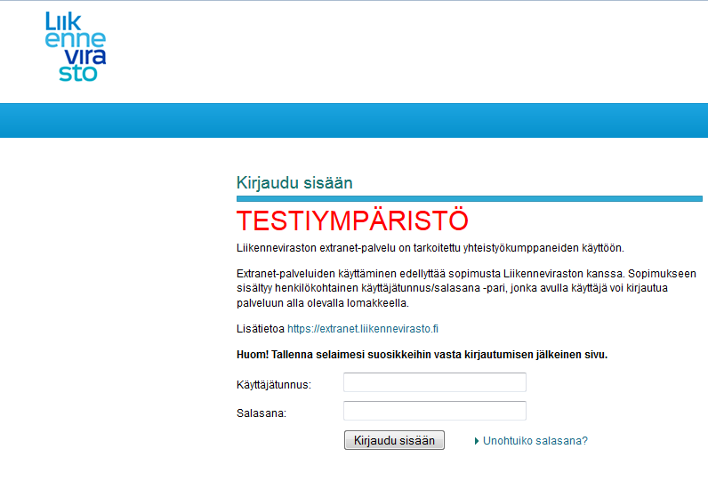

_Kirjautuminen Digiroadiin._

Kirjautumisen j&auml;lkeen avautuu Digiroad-selainsovelluksen karttak&auml;ytt&ouml;liittym&auml;n katselutila. Maantieteellisesti kartalla on n&auml;kyviss&auml; alue, johon k&auml;ytt&auml;j&auml;ll&auml; on oikeudet (kts. [Miten p&auml;&auml;st&auml; alkuun](#1._Miten_p&auml;&auml;st&auml;_alkuun?)).

_Karttak&auml;ytt&ouml;liittym&auml;n katselutila._

Mik&auml;li kirjautumisen j&auml;lkeen ei avaudu karttak&auml;ytt&ouml;liittym&auml;n katselutilaa, ei k&auml;ytt&auml;j&auml;ll&auml; ole oikeuksia Digiroad-sovellukseen. Digiroad-oikeuksia voi pyyt&auml;&auml; Digiroad-palvelusta (kts. [Miten p&auml;&auml;st&auml; alkuun](#1._Miten_p&auml;&auml;st&auml;_alkuun?)).

2. Yleist&auml;
----------

Sovelluksella on kaksi tilaa: katselu- ja muokkaustila. Jos k&auml;ytt&auml;j&auml;n rooli on katselija, h&auml;n p&auml;&auml;see vain katselutilaan. Muokkaajan roolissa oleva k&auml;ytt&auml;j&auml; p&auml;&auml;see sek&auml; katselu- ett&auml; muokkaustilaan. Kirjautumisen j&auml;lkeen avautuu katselutila, jossa voi ainoastaan katsella eri tietolajeja, esimerkiksi pys&auml;kkej&auml; tai nopeusrajoituksia. Tietolajien muokkaus suoritetaan muokkaustilassa. Molemmissa tiloissa n&auml;kyv&auml;t ainoastaan ne tietolajit, joihin k&auml;ytt&auml;j&auml;ll&auml; on oikeudet (kts. [Miten p&auml;&auml;st&auml; alkuun](#1._Miten_p&auml;&auml;st&auml;_alkuun?)). Kartalle voi valita yhden tietolajin kerrallaan. Tietolaji valitaan sivun vasemman reunan tietolajit-paletista (1).

Muokkaustilan saa aktivoitua tietolajikohtaisesti klikkaamalla "Siirry muokkaustilaan"-painiketta (3). Muokkaustilassa kartan yl&auml;osassa on teksti "Olet muokkaustilassa. Kuntak&auml;ytt&auml;jien tulee kohdistaa muutokset katuverkolle, ELY-k&auml;ytt&auml;jien maantieverkolle." (14). Muokkaustilassa tehdyt muutokset tallentuvat painamalla "Tallenna"-painiketta (15). Muutosten tallentamisen j&auml;lkeen tietolajille tallentuu Muokattu viimeksi -kohtaan muokkaajan k&auml;ytt&auml;j&auml;tunnus, p&auml;iv&auml;m&auml;&auml;r&auml; ja kellonaika. Tehdyt muutokset peruuntuvat painamalla Peruuta-painiketta (16). Tallenna- ja Peruuta -painikkeet eiv&auml;t ole aktiivisia, kun muutoksia ei ole tehty. Jos muutoksia on tehnyt eik&auml; niit&auml; peru tai tallenna ja siirtyy muokkaamaan toista kohdetta tai pois auki olevan tietolajin muokkaustilasta, sovellus antaa muutos-ilmoituksen, joka kertoo, ett&auml; muutoksia on tehty ja ne tulee tallentaa tai peruuttaa ennen kuin voi jatkaa. Takaisin katselutilaan p&auml;&auml;see klikkaamalla "Siirry katselutilaan"-painiketta (11).

Kaikki tietolajit n&auml;kyv&auml;t sek&auml; katselu- ett&auml; muokkaustilassa vain, kun kartan mittakaava on 1:20 000 tai tarkempi. Sovellus ilmoittaa, kun kartan mittakaava on liian ep&auml;tarkka tietolajin n&auml;kymiselle.

_Katselutila._

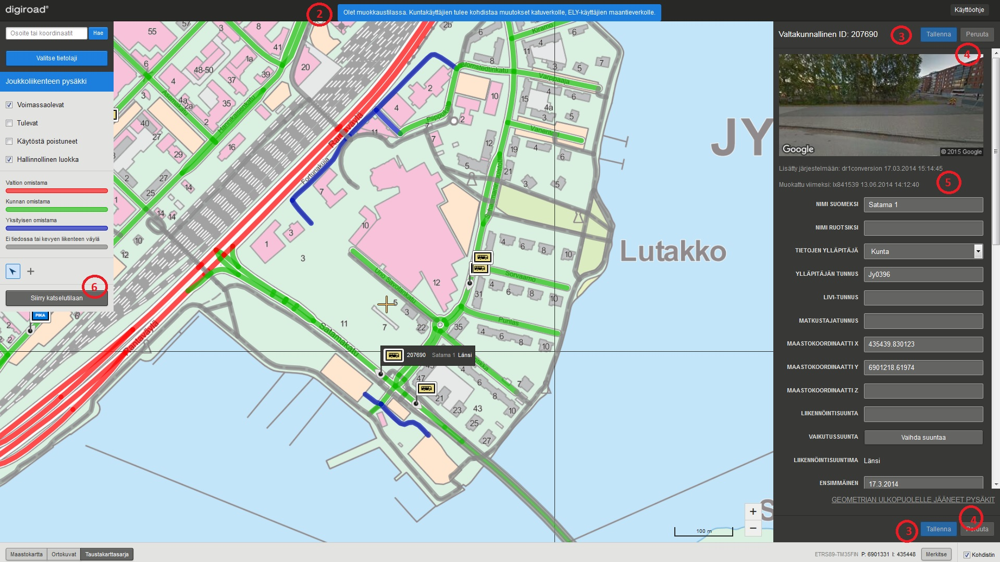

_Muokkaustila._

2.1 Karttan&auml;kym&auml;n muokkaus
--------------------------

####Kartan liikutus####

Karttaa liikutetaan raahaamalla.

####Mittakaavataso####

Kartan mittakaavatasoa muutetaan joko hiiren rullalla, tuplaklikkaamalla, Shift+piirto (alue) tai mittakaavapainikkeista  (7). Mittakaavapainikkeita k&auml;ytt&auml;m&auml;ll&auml; kartan keskitys s&auml;ilyy. Hiiren rullalla, tuplaklikkaamalla tai Shift+piirto (alue) kartan keskitys siirtyy kursorin kohtaan.  K&auml;yt&ouml;ss&auml; oleva mittakaavataso n&auml;kyy kartan vasemmassa alakulmassa (9).

####Karttahaut####

K&auml;ytt&ouml;liittym&auml;ss&auml; on hakukentt&auml; (2), jossa voi hakea koordinaateilla, katuosoitteella tai tieosoitteella. Haku suoritetaan kirjoittamalla hakuehto hakukentt&auml;&auml;n ja klikkaamalla Hae. Hakutulos tulee listaan hakukent&auml;n alle. Hakutuloslistassa ylimp&auml;n&auml; on maantieteellisesti kartan nykyist&auml; keskipistett&auml; l&auml;himp&auml;n&auml; oleva kohde. Mik&auml;li hakutuloksia on vain yksi, keskittyy kartta automaattisesti haettuun kohteeseen. Jos hakutuloksia on useampi kuin yksi, t&auml;ytyy listalta valita tulos, jolloin kartta keskittyy siihen. Tyhjenn&auml; tulokset -painike tyhjent&auml;&auml; hakutuloslistan.

Koordinaateilla haku: Koordinaatit sy&ouml;tet&auml;&auml;n muodossa "pohjoinen (7 merkki&auml;), it&auml; (6 merkki&auml;)". Koordinaatit tulee olla ETRS89-TM35FIN -koordinaattij&auml;rjestelm&auml;ss&auml;. Esim. "6975061, 535628".

Katuosoitteella haku: Katuosoitteesta hakukentt&auml;&auml;n voi sy&ouml;tt&auml;&auml; koko ositteen tai sen osan. Esim. "Mannerheimintie" tai "Mannerheimintie 10, Helsinki".

Tieosoitteella haku: Tieosoitteesta hakukentt&auml;&auml;n voi sy&ouml;tt&auml;&auml; koko osoitteen tai osan siit&auml;. Esim. "2" tai "2 1 150".

####Merkitse piste kartalla####

Merkitse-painike (10) merkitsee sinisen pisteen kartan keskipisteeseen. Merkki poistuu vain, kun merkit&auml;&auml;n uusi piste kartalta. Merkitse-painikkeen vieress&auml; olevat koordinaatit seuraavat kartan keskipistett&auml; ja p&auml;ivittyv&auml;t, kun kartan keskipiste muuttuu.

####Taustakartat####

Taustakartaksi voi valita maastokartan, ortokuvat tai taustakarttasarjan. (8)

_Karttan&auml;kym&auml;n muokkaus._

3. Tielinkit
------------

Tielinkki on tien, kadun, kevyen liikenteen v&auml;yl&auml;n tai lauttayhteyden keskilinjageometrian pienin yksikk&ouml;. Tielinkin ominaisuustiedot ovat aina voimassa koko tielinkin matkalla. Karttan&auml;kym&auml;&auml;n valitaan tielinkit valitsemalla tietolajit-paletista (1) Tielinkit.

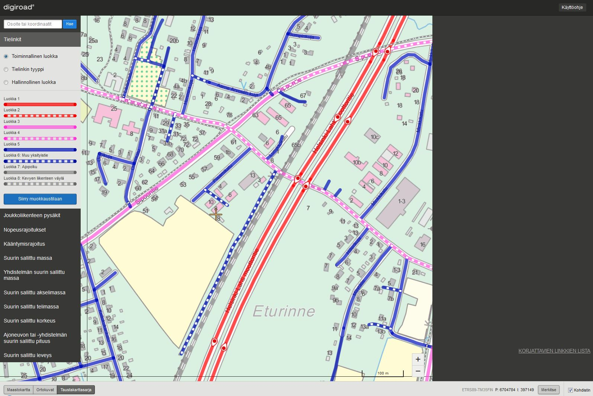

_Tielinkit._

####Tielinkkien haku####

Tielinkkej&auml; haetaan tielinkin MML-ID:ll&auml; yksil&ouml;idyll&auml; URL-osoitteella. Esimerkki URL-osoitteesta:

 <a href=https://testiextranet.liikennevirasto.fi/digiroad/#linkProperty/373320541 target="_blank">https://testiextranet.liikennevirasto.fi/digiroad/#linkProperty/373320541 </a>

jossa numerosarja 373320541 on tielinkin MML-ID. Toiminto tarkentaa karttak&auml;tt&ouml;liittym&auml;n haetun tielinkin kohdalle. Tielinkin ominaisuustieton&auml;kym&auml; aukeaa sivun oikealle puolelle.

##Tielinkin tietojen katselu##

Yksitt&auml;isen tielinkin ominaisuustiedot tulevat n&auml;kyviin, kun tielinkin geometriaa kartalla klikataan (4). T&auml;ll&ouml;in tielinkin geometria korostuu kartalla ja sen ominaisuustiedot avautuvat ominaisuustieton&auml;kym&auml;&auml;n (6). Tielinkin ominaisuustietoja ovat tielinkin ID, Maanmittauslaitoksen ID (MML ID), hallinnollinen luokka, toiminnallinen luokka, liikennevirran suunta, tielinkin tyyppi, kuntanumero, tien nimi (suomi, ruotsi, saame) ja osoitenumerot vasemmalla ja oikealla.

Tielinkeille voi valita visualisoinnin Tietolajit -paletista (1) tielinkkien alta. Visualisoinnin voi valita toiminnallisen luokan, tielinkin tyypin tai hallinnollisen luokan mukaan. Valinnan mukaan visualisoinnin selitteet n&auml;kyv&auml;t Tietolajit-paletissa. Lis&auml;ksi tielinkill&auml; on visualisoitu suuntanuoli, mik&auml;li tielinkin liikennevirran suunta on vain toiseen suuntaan.

Toiminnallisen luokan selitteet ovat:

Luokka 1: Ohjeellisesti valtatie tai seudullinen p&auml;&auml;katu
Luokka 2: Ohjeellisesti kantatie tai seudullinen p&auml;&auml;katu
Luokka 3: Ohjeellisesti seututie tai alueellinen p&auml;&auml;katu
Luokka 4: Ohjeellisesti yhdystie tai kokoojakatu
Luokka 5: Liitynt&auml;katu, t&auml;rke&auml; yksityistie
Luokka 6: Muu yksityistie
Luokka 7: Ajopolku
Luokka 8: Kevyen liikenteen v&auml;yl&auml;

_Tielinkit visualisoitu toiminnallisen luokan mukaan._

_Tielinkit visualisoitu tielinkin tyypin mukaan._

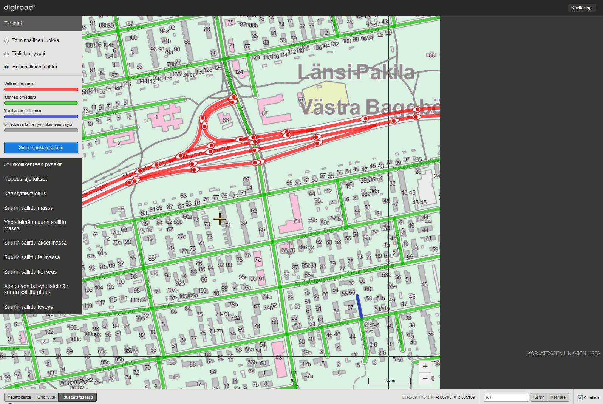

_Tielinkit visualisoitu hallinnollisen luokan mukaan._

##Tielinkin ominaisuustietojen muokkaus##

Yksitt&auml;isen tielinkin ominaisuustietoja voi muokata siirtym&auml;ll&auml; muokkaustilaan. Muokattava tielinkki valitaan hiirell&auml; klikkaamalla.

Tielinkin ominaisuustiedoista toiminnallinen luokka, liikennevirran suunta ja tielinkin tyyppi ovat muokattavissa.

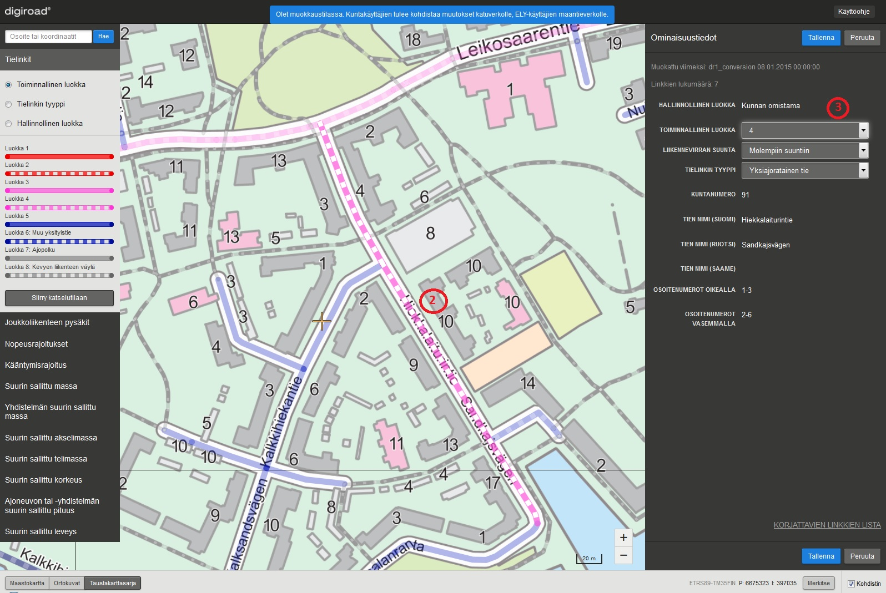

_Tielinkin ominaisuustietojen muokkaus._

####Korjattavat tielinkit####

Uudet linkit ovat korjattavien linkkien listalla, koska niilt&auml; puuttuu toiminnallinen luokka tai linkin tyyppi (1). Korjattavien linkkien lista on luokiteltu tien omistajuuden mukaan. Linkki on kartalla musta, kunnes tieto on lis&auml;tty. Korjattavien linkkien listaan p&auml;&auml;see tielinkki-tasolta ominaisuustietotaulun alareunassa olevan painikkeen kautta (2). Listasta voi klikata korjattavaa tielinkki&auml; (3), jolloin sovellus avautuu kyseisen linkin kohdalta. Korjattava linkki poistuu listalta vasta sitten, kun sille on lis&auml;tty sek&auml; toiminnallinen luokka ett&auml; linkkityyppi. 

Korjattavilla linkeill&auml; on liikennevirran suunta -tieto valmiina. Tieto tulee Maanmittauslaitokselta geometriatiedon yhteydess&auml;. Jos tiedoissa on virheit&auml;, voi virheelliset liikennevirran suunta -tiedot voi korjata k&auml;ytt&ouml;liittym&auml;ss&auml; samalla kun linkille lis&auml;t&auml;&auml;n toiminnallinen luokka ja linkkityyppi. Korjattavien linkkien listaan ei tule uusia kevyen liikenteen v&auml;ylien, ajopolkujen ja ajoteiden tielinkkej&auml;, koska n&auml;iden tiedot saadaan Maanmittauslaitokselta. Toiminnallinen luokka ja tielinkin tyyppi t&auml;ydennet&auml;&auml;n n&auml;ille tielinkille automaattisesti. 

_Korjattava linkki._

_Korjattavien linkkien lista._

4. Joukkoliikenteen pys&auml;kit
--------------------------------

Joukkoliikenteen pys&auml;kit ovat julkisen liikenteen k&auml;yt&ouml;ss&auml; olevia pys&auml;kkej&auml;: linja-autojen paikallisliikenteen, linja-autojen kaukoliikenteen, linja-autojen pikavuorojen ja raitiovaunujen pys&auml;kit sek&auml; virtuaalipys&auml;kit. Karttan&auml;kym&auml;&auml;n voi valita pys&auml;kkej&auml; valitsemalla tietolajit-paletista (1) Joukkoliikenteen pys&auml;kit. Pys&auml;kkej&auml; valitaan pys&auml;kin voimassaolon mukaan: voimassa olevat, tulevat ja/tai k&auml;yt&ouml;st&auml; poistuneet. Valitseminen toimii samalla tavalla sek&auml; katselu- ett&auml; muokkaustilassa.

Tielinkeill&auml; on pys&auml;kkin&auml;kym&auml;ss&auml; oletuksena v&auml;rill&auml; korostettu Hallinnollinen luokka -valinta p&auml;&auml;ll&auml;. Valinnan saa pois klikkamalla tietolajit-valikon (1) "Joukkoliikenteen pys&auml;kit" kohdasta Hallinnollinen luokka-valinnan pois. Sininen v&auml;ri tarkoittaa yksityisen omistamaa tielinkki&auml;, vihre&auml; kunnan omistamaa ja punainen valtion omistamaa. Harmaalla korostettujen tielinkkien omistaja ei ole tiedossa. 

_Joukkoliikenteen pys&auml;kkien valinta._

####Joukkoliikenteen pys&auml;kkien haku####

Joukkoliikenteen pys&auml;kkej&auml; haetaan pys&auml;kin kansallisella ID:ll&auml; yksil&ouml;idyll&auml; URL-osoitteella. Sovelluksen t&auml;ytyy olla pys&auml;kkin&auml;kym&auml;ss&auml; pys&auml;kki&auml; haettaessa. Esimerkki URL-osoitteesta:

 <a href=https://testiextranet.liikennevirasto.fi/digiroad/#/asset/95374  target="_blank">https://testiextranet.liikennevirasto.fi/digiroad/#/asset/95374  </a>(17)

jossa numerosarja 95374 on pys&auml;kin kansallinen ID. Toiminto tarkentaa karttak&auml;ytt&ouml;liittym&auml;n katselutilan haetun pys&auml;kin kohdalle. Pys&auml;kin ominaisuustieton&auml;kym&auml; (6) aukeaa sivun oikealle puolelle. 

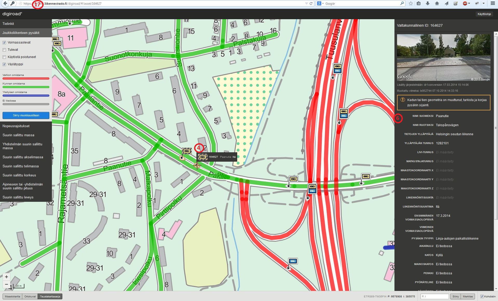

_Joukkoliikenteen pys&auml;kkien haku._

##Pys&auml;kin tietojen katselu##

Yksitt&auml;isen pys&auml;kin ominaisuustiedot tulevat n&auml;kyviin, kun pys&auml;kki&auml; klikataan. T&auml;ll&ouml;in sivun oikeaan laitaan avautuu Google Street View (5) ja ominaisuustieto -n&auml;kym&auml;t (6). Valitulle pys&auml;kille avautuu infokupla, jossa n&auml;kyy pys&auml;kin valtakunnallinen ID, suomenkielinen nimi, liikenn&ouml;intisuuntima ja pys&auml;kin tyyppi kuvana. (4)

Jos kaksi tai useampi pys&auml;kki ovat alle kuuden metrin p&auml;&auml;ss&auml; toisistaan, esitet&auml;&auml;n pys&auml;kit k&auml;ytt&ouml;liittym&auml;ss&auml; p&auml;&auml;llekk&auml;in ryhmiteltyn&auml;. P&auml;&auml;llekk&auml;in asettelu mahdollistaa pys&auml;kin tarkastelun ilman, ett&auml; samassa sijainnissa olevia pys&auml;kkej&auml; tarvitsee siirt&auml;&auml;. 

Ominaisuustieto-n&auml;kym&auml;ss&auml; kentti&auml; ei voi muokata. Google Street View -kuvaa klikkaamalla avautuu Google Street View uudelle v&auml;lilehdelle. Pys&auml;kin valinnan saa pois klikkaamalla karttaa.

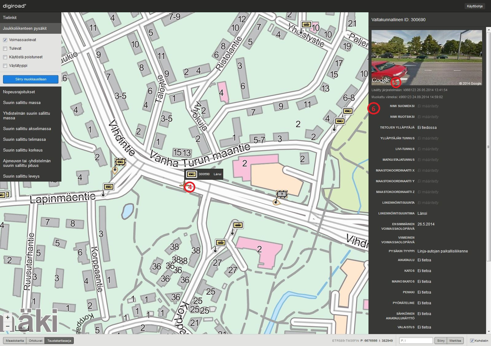

_Joukkoliikenteen pys&auml;kin tietojen katselu._

####Kelluvat pys&auml;kit####

Joukkoliikenteen pys&auml;kki voi olla kelluva, jos tielinkkigeometria sen alla on muuttunut niin paljon, ettei j&auml;rjestelm&auml; pysty en&auml;&auml; p&auml;&auml;ttelem&auml;&auml;n sen sijaintia geometrialla. Kelluvat pys&auml;kit on korostettu karttan&auml;kym&auml;ss&auml; alla olevan kuvan tavoin, ja niiden ominaisuustieton&auml;kym&auml;ss&auml; on huomautus, ett&auml; pys&auml;kki tulisi siirt&auml;&auml; tielinkille, jotta kelluvuus poistuu (kts. [Pys&auml;kin siirt&auml;minen](#Pys&auml;kin_siirt&auml;minen)). 

_Kelluvat pys&auml;kit on visualisoitu eri tavoin._

Kelluvat pys&auml;kit on listattu omaan listaan, johon on linkki pys&auml;kkien ominaisuustieton&auml;kym&auml;ss&auml; (1). Pys&auml;kit on jaoteltu listalle kunnan sek&auml; kunnan sis&auml;ll&auml; hallinnollisen luokan (kunta, valtio, yksityinen) mukaan. Listalla n&auml;kyy vain ne pys&auml;kit, joihin k&auml;ytt&auml;j&auml;ll&auml; on muokkausoikeus. Kelluvasta pys&auml;kist&auml; on listassa linkki, josta p&auml;&auml;see suoraan pys&auml;kin kohdalle sovelluksessa ja sen voi siirt&auml;&auml; takaisin geometrialle. Lista sulkeutuu Sulje lista -painikkeesta.

_Kelluvien pys&auml;kkien lista._

##Joukkoliikenteen pys&auml;kin ominaisuustietojen muokkaus##

Yksitt&auml;isen pys&auml;kin ominaisuustietoja voi muokata valitsemalla muokkausty&ouml;kalun (12). Muokattava pys&auml;kki valitaan hiirell&auml; klikkaamalla. P&auml;&auml;llekk&auml;in esitetyist&auml; pys&auml;keist&auml; voi valita yhden pys&auml;kin klikkaamalla pys&auml;kki&auml;. Pinosta valitun pys&auml;kin erottaa sille avautuvasta infoikkunasta. Valittaessa pys&auml;kin sivun oikeaan laitaan avautuu Google Street View -n&auml;kym&auml; (5) pys&auml;kist&auml; sek&auml; pys&auml;kin ominaisuustiedot (6). Jos pys&auml;kill&auml; ei ole tyyppi&auml;, tulee se asettaa ennen tallentamista. Pys&auml;kkien ominaisuustieton&auml;kym&auml;ss&auml; n&auml;kyy ilmoitus, jos pys&auml;kilt&auml; puuttuu pakollisia tietoja.

Pys&auml;kin valinnan saa pois klikkaamalla karttaa, kun tallennus tai peruutus on tehty.

_Joukkoliikenteen pys&auml;kin ominaisuustietojen muokkaus._

####Pys&auml;kin vaikutussuunnan muuttaminen####

Googlen Street View -n&auml;kym&auml; (5) sivun oikeassa laidassa on suunnattu suuntaan, jossa pys&auml;kin tallennetun vaikutussuunnan mukaan kuuluisi olla. Painamalla n&auml;kym&auml;&auml; avautuu Googlen Street View -v&auml;lilehti, jossa pys&auml;kin ymp&auml;rist&ouml;&auml; voi tarkastella tarkemmin. Kartalla pys&auml;kin vaikutussuunta n&auml;kyy pisarana pys&auml;kkikuvakkeella (10). Pisaran k&auml;rki osoittaa pys&auml;kin vaikutussuunnan suuntaan.

Pys&auml;kin vaikutussuunnan voi muuttaa ominaisuustieton&auml;kym&auml;ss&auml; (6) painamalla "Vaihda suuntaa"-painiketta (18). Pys&auml;kin vaikutussuuntaa muutettaessa Googlen Street View -n&auml;kym&auml; (5) muuttuu vastaamaan uutta vaikutussuuntaa ja pisaran suunta k&auml;&auml;ntyy.

_Joukkoliikenteen pys&auml;kin vaikutussuunnan voi muuttaa painamalla "Vaihda suuntaa"-painiketta (18)._

####Pys&auml;kin voimassaolop&auml;ivien muokkaus####

Ensimm&auml;inen voimassaolop&auml;iv&auml; (19) tarkoittaa p&auml;iv&auml;m&auml;&auml;r&auml;&auml;, josta l&auml;htien pys&auml;kki on k&auml;yt&ouml;ss&auml;. Viimeinen voimassaolop&auml;iv&auml; (20) tarkoittaa p&auml;iv&auml;m&auml;&auml;r&auml;&auml;, jolloin pys&auml;kki on viimeisen kerran k&auml;yt&ouml;ss&auml;. Molempia p&auml;iv&auml;m&auml;&auml;ri&auml; voi muokata ominaisuustieto -n&auml;kym&auml;n (6) kautta. P&auml;iv&auml;m&auml;&auml;ri&auml; voi muokata joko kirjoittamalla ne p&auml;iv&auml;m&auml;&auml;r&auml;kentt&auml;&auml;n muodossa pp.kk.vvvv tai valitsemalla ne kalenterista, joka avautuu, kun p&auml;iv&auml;m&auml;&auml;r&auml;kentt&auml;&auml; klikkaa.

P&auml;iv&auml;m&auml;&auml;ri&auml; ei voi asettaa ristiin siten, ett&auml; "Ensimm&auml;inen voimassaolop&auml;iv&auml;" olisi my&ouml;hemmin kuin "Viimeinen voimassaolop&auml;iv&auml;". Kalenterissa ei-sallitut p&auml;iv&auml;m&auml;&auml;r&auml;t eiv&auml;t ole valittavissa. Jos p&auml;iv&auml;m&auml;&auml;r&auml;kentt&auml;&auml;n kirjoittaa p&auml;iv&auml;m&auml;&auml;r&auml;n, joka asettaa p&auml;iv&auml;m&auml;&auml;r&auml;t ristiin, ei p&auml;iv&auml;m&auml;&auml;r&auml; tallennu.

Jos "Ensimm&auml;inen voimassaolop&auml;iv&auml;" tai "Viimeinen voimassaolop&auml;iv&auml;" ei ole tiedossa, voi kalenterista valita "ei tietoa".

_Pys&auml;kin voimassaolop&auml;ivien muokkaus._

####Pys&auml;kin muiden ominaisuustietojen muokkaus####

Muita ominaisuustietoja voi muokata oikeassa laidassa olevan ominaisuustieton&auml;kym&auml;n (6) kautta. Tietoja muokataan joko kirjoittamalla tietokentt&auml;&auml;n, valitsemalla pudotusvalikosta tieto tai merkitsem&auml;ll&auml; rasti ruutuun oikean/oikeiden tietojen kohdalle.

_Joukkoliikenteen pys&auml;kin ominaisuustietojen muokkaus._

####Ominaisuustiedot:####

Ominaisuustiedot ovat j&auml;rjestelm&auml;n generoimia tai k&auml;ytt&auml;j&auml;n sy&ouml;tt&auml;mi&auml;. Sy&ouml;tett&auml;v&auml;t ominaisuustietokent&auml;t ovat tekstikentti&auml;, joihin ominaisuustieto kirjoitetaan merkkijonona, monivalintoja, josta voi valita oikeat vaihtoehdot tai pudotusvalikkovalintoja, joista voi valita yhden vaihtoehdon.

|Ominaisuustieto|Kuvaus|Sovellus generoi|
|---------------|------|----------------|
|Valtakunnallinen ID|Pys&auml;kin valtakunnallinen ID|X|
|Lis&auml;tty j&auml;rjestelm&auml;&auml;n|Tiedon luojan k&auml;ytt&auml;j&auml;tunnus tai massaimportin l&auml;hde ja tiedon lis&auml;yshetki.|X|
|Muokattu viimeksi|Muokkaajan k&auml;ytt&auml;j&auml;tunnus ja tiedon muokkaushetki. |X|
|Liikenn&ouml;intisuuntima| Sovellus laskee itse tiegeometriasta. Pohjoinen on nolla astetta ja koko kierros my&ouml;t&auml;p&auml;iv&auml;&auml;n 360 astetta. Ilmoitetaan asteluvun mukaan pohjoinen, it&auml;, etel&auml; tai l&auml;nsi.|X|
|Nimi suomeksi|Pys&auml;kin nimi suomen kielell&auml;. Nimen tulee olla valtakunnallisesti yksil&ouml;iv&auml;. Esim. Ei "Linja-autoasema" vaan "Porvoon linja-autoasema".||
|Nimi ruotsiksi| Pys&auml;kin nimi ruotsin kielell&auml;. ||
|Tietojen yll&auml;pit&auml;j&auml;| Yll&auml;pit&auml;v&auml; viranomainen: kunta, Helsingin seudun liikenne tai ELY-keskus.||
|Yll&auml;pit&auml;j&auml;n tunnus| Tietojen yll&auml;pit&auml;j&auml;n sis&auml;inen tunnus pys&auml;kille.||
|LIVI-tunnus| Pys&auml;kin Livi-tunniste, vastaava tunnus kuin Tierekisteriss&auml;. K&auml;yt&ouml;ss&auml; vain maanteiden pys&auml;keill&auml;.||
|Matkustajatunnus| Pys&auml;kin tunnus, joka n&auml;kyy matkustajalle.||
|Maastokoordinaatti X| Pys&auml;kin sijainnin mitattu X-koordinaatti: EUREF FIN ETRS89-TM35FIN.||
|Maastokoordinaatti Y:| Pys&auml;kin sijainnin mitattu Y-koordinaatti: EUREF FIN ETRS89-TM35FIN.||
|Maastokoordinaatti Z| Pys&auml;kin sijainnin mitattu Z-koordinaatti: N2000 korkeusj&auml;rjestelm&auml;ss&auml;.||
|Liikenn&ouml;intisuunta|Pys&auml;kin suunta sanallisesti kuvattuna. Esimerkiksi:"Keskustaan".||
|Vaikutussuunta| Vaikutussuunta on visualisoitu pys&auml;kin liikennevirran suunnaksi pisaralla (9). Google Street View (4) osoittaa suuntaan, jossa pys&auml;kin kuuluisi olla.||
|Ensimm&auml;inen voimassaolop&auml;iv&auml;| P&auml;iv&auml;m&auml;&auml;r&auml;, jolloin pys&auml;kki on ensimm&auml;isen kerran k&auml;yt&ouml;ss&auml;.||
|Viimeinen voimassaolop&auml;iv&auml;| P&auml;iv&auml;m&auml;&auml;r&auml;, jolloin pys&auml;kki on viimeisen kerran k&auml;yt&ouml;ss&auml;.||
|Pys&auml;kin tyyppi| __Pakollinen tieto!__ Linja-autojen paikallisliikenne, raitiovaunu, linja-autojen kaukoliikenne, linja-autojen pikavuoro tai virtuaalipys&auml;kki.||
|Aikataulu| Paperinen, pys&auml;kin sein&auml;&auml;n tai tolppaan aikataulukehikkoon kiinnitetty aikataulu, joka sis&auml;lt&auml;&auml; tiedot pys&auml;kill&auml; liikenn&ouml;ivien reittien l&auml;ht&ouml;ajoista sek&auml; mahdollisesti my&ouml;s pys&auml;kkikohtaisista ohitusajoista. Mahdolliset arvot: kyll&auml;, ei tai ei tietoa. Oletuksena on "ei tietoa".||
|Katos| Pys&auml;kkialueella sijaitseva, joukkoliikennev&auml;linett&auml; odottaville matkustajille tarkoitettu s&auml;&auml;lt&auml; suojaava katos. Mahdolliset arvot: kyll&auml;, ei tai ei tietoa. Oletuksena on "ei tietoa".||
|Mainoskatos| Pys&auml;kkialueella sijaitseva, joukkoliikennev&auml;linett&auml; odottaville matkustajille tarkoitettu s&auml;&auml;lt&auml; suojaava katos, joka sis&auml;lt&auml;&auml; mainoksia. Pys&auml;kin kunnossapidosta vastaa t&auml;ll&ouml;in mainosten yll&auml;pit&auml;j&auml;. Mahdolliset arvot: kyll&auml;, ei tai ei tietoa. Oletuksena on "ei tietoa".||
|Penkki| Pys&auml;kkialueella sijaitseva, joukkoliikennett&auml; odottavilla matkustajille tarkoitettu penkki, joka sijaitsee yleisimmin pys&auml;kkikatoksen alla. Mahdolliset arvot: kyll&auml;, ei tai ei tietoa. Oletuksena on "ei tietoa".||
|Py&ouml;r&auml;teline| Kyll&auml;, ei tai ei tietoa. Oletuksena on "ei tietoa".||
|S&auml;hk&ouml;inen aikataulun&auml;ytt&ouml;|Pys&auml;kkialueelta l&ouml;ytyv&auml; s&auml;hk&ouml;inen aikataulun&auml;ytt&ouml;, joka tuottaa reaaliaikaisen informaation pys&auml;kill&auml; kulkevasta liikenteest&auml;. Mahdolliset arvot: kyll&auml;, ei tai ei tietoa. Oletuksena on "ei tietoa".||
|Valaistus| Pys&auml;kin valaistuksella tarkoitetaan yleisimmin pys&auml;kin kattoon upotettuja valoelementtej&auml;, jotka tuottavat valaistuksen pys&auml;kkikatoksen sis&auml;lle. Mahdolliset arvot: kyll&auml;, ei tai ei tietoa. Oletuksena on "ei tietoa".||
|Esteett&ouml;myys liikuntarajoitteiselle| Pys&auml;kki on esteet&ouml;n, mik&auml;li se mahdollistaa itsen&auml;isen, esteett&ouml;m&auml;n matkustamisen ja odottelun my&ouml;s erityisryhmille, esim. py&ouml;r&auml;tuolilla liikkuville. Pys&auml;kin esteett&ouml;myyteen vaikuttavat pys&auml;kki- ja laiturirakenteiden, asema- ja terminaalirakenteiden sek&auml; aikatauluinformaation esteett&ouml;myys. Oletuksena on "ei tiedossa".||
|Saattomahdollisuus henkil&ouml;autolla| Ilmaisee, mik&auml;li (valtatien varrella olevaa) pys&auml;ki&auml; varten on rakennettu erillinen matkustajien nouto/saatto-alue. Mahdolliset arvot: kyll&auml;, ei tai ei tietoa. Oletuksena on "ei tietoa".||
|Liitynt&auml;pys&auml;k&ouml;intipaikkojen m&auml;&auml;r&auml;| Keskusta-alueen ulkopuolella olevan pys&auml;kki- tai terminaalialueen l&auml;heisyydess&auml; sijaitsevien, auton pys&auml;k&ouml;imist&auml; varten varattujen parkkipaikkojen m&auml;&auml;r&auml;. Kentt&auml; j&auml;tet&auml;&auml;n tyhj&auml;ksi, mik&auml;li liitynt&auml;pys&auml;k&ouml;intipaikkoja ei ole. Mik&auml;li liitynt&auml;pys&auml;k&ouml;intipaikat palvelevat useampaa pys&auml;kki&auml;, t&auml;ytet&auml;&auml;n tiedot liitynt&auml;pys&auml;k&ouml;innist&auml; erikseen kullekin pys&auml;kille.||
|Liitynt&auml;pys&auml;k&ouml;innin lis&auml;tiedot| Pys&auml;kin yhteydess&auml; olevien liitynt&auml;pys&auml;k&ouml;intipaikkojen lis&auml;tiedot.||
|Pys&auml;kin omistaja| Kunta, Helsingin seudun liikenne, ELY-keskus tai Liikennevirasto. Erikoistapauksia varten (esim. uudenmaan ELY).||
|Palauteosoite| Osoite, johon pys&auml;kist&auml; voi laittaa palautetta. Esimerkiksi s&auml;hk&ouml;postiosoite.||
|Lis&auml;tiedot| Julkiset kommentit. Esimerkiksi: "Alueella tiet&ouml;it&auml;".||

####Pys&auml;kin siirt&auml;minen####

Pys&auml;kki&auml; siirret&auml;&auml;n k&auml;ytt&auml;m&auml;ll&auml; muokkausty&ouml;kalua (12). Pys&auml;kkej&auml; voi siirt&auml;&auml; vain tarpeeksi tarkalta mittakaavatasolta, joka on 1:10 000 tai tarkempi (9).

Siirt&auml;minen tapahtuu tarttumalla pys&auml;kkiin kiinni ja raahaamalla se oikeaan paikkaan. Pys&auml;kki liikkuu vain olemassa olevia tielinkkej&auml; (ei tielinkeill&auml;, jotka ovat kevyen liikenteen v&auml;yli&auml; tai lautta/lossi v&auml;yli&auml;) pitkin ja k&auml;ytt&auml;j&auml;n p&auml;ivitysoikeuksien sallimien maantieteellisten rajojen sis&auml;puolella. Jos pys&auml;kin irrottaa tielinkist&auml;, kiinnittyy se automaattisesti l&auml;himp&auml;&auml;n tielinkkiin, joka on k&auml;ytt&auml;j&auml;n p&auml;ivitysoikeuksien sallimalla maantietellisell&auml; alueella. Jos riitt&auml;v&auml;n l&auml;hell&auml;  ei ole toista tielinkki&auml;, ei pys&auml;kki irtoa linkilt&auml;, jolla se on. Tielinkki, jonka p&auml;&auml;ll&auml; pys&auml;kki on, n&auml;kyy sinisell&auml; korostusv&auml;rill&auml;. Kun pys&auml;kist&auml; p&auml;&auml;stet&auml;&auml;n irti (lasketaan se uuteen sijaintiin), oikealle avautuu Google Street View (5) ja ominaisuustieto -n&auml;kym&auml; (6), jonka kautta voi halutessaan muokata muita ominaisuustietoja. Pys&auml;kin siirt&auml;minen ei muuta pys&auml;kin mitattuja maastokoordinaatteja vaan ne s&auml;ilyv&auml;t ennallaan. Pys&auml;kin uusi sijainti tallettuu painamalla Tallenna-painiketta (15). Painamalla Peruuta-painiketta (16) pys&auml;kki palautuu alkuper&auml;iselle paikalleen. Jos pys&auml;kilt&auml; puuttuu tyyppi, tulee se t&auml;ydent&auml;&auml; ennen tallentamista. Pys&auml;kkien ominaisustieton&auml;kym&auml;ss&auml; n&auml;kyy ilmoitus, jos pys&auml;kilt&auml; puuttuu pakollisia tietoja.

Siirrett&auml;ess&auml; pys&auml;kki&auml;, joka on pinossa, j&auml;&auml; pinoon siirrett&auml;v&auml;n pys&auml;kin kohdalle rako, kunnes siirron tallentaa tai peruuttaa. Jos pys&auml;kin siirt&auml;&auml; alle kuuden metrin p&auml;&auml;h&auml;n toisesta/toisista pys&auml;keist&auml;, siirtyy pys&auml;kki osaksi pinoa.

Pys&auml;kin siirto t&auml;ytyy tallentaa tai peruuttaa ennen kuin voi siirty&auml; muokkaamaan muita pys&auml;kkej&auml; tai pois muokkaustilasta. Sovellus ilmoittaa tehdyst&auml; muutoksesta muutos-dialogilla.

_Joukkoliikenteen pys&auml;kin siirt&auml;minen._

####Uuden pys&auml;kin lis&auml;&auml;minen####

Uusia pys&auml;kkej&auml; voi lis&auml;t&auml;, kun mittakaavataso on 1:10 000 tai tarkempi. T&auml;m&auml; mittakaavataso on yht&auml; tasoa tarkempi kuin uloin mittakaavataso jolla pys&auml;kit n&auml;ytet&auml;&auml;n. Uusi pys&auml;kki luodaan klikkaamalla kartan tiest&ouml;st&auml; haluttu sijainti pys&auml;kille lis&auml;ysty&ouml;kalulla (13). Jos valitulla kohdalla ei ole tielinkki&auml;, muodostuu pys&auml;kki l&auml;himm&auml;lle tielinkille. Jos pys&auml;kin yritt&auml;&auml; luoda liian kauas l&auml;himm&auml;st&auml; tielinkist&auml;, ei pys&auml;kki&auml; muodostu. Uusi pys&auml;kki on korostettu sinisell&auml; v&auml;rill&auml; (4) ja sivun oikealle puolelle avautuu Google Street View (5) ja ominaisuustieton&auml;kym&auml; (6), jossa pys&auml;kille tallennetaan tiedossa olevat ominaisuustiedot.

Sovellus muodostaa osan ominaisuustiedoista itse, jos niit&auml; ei m&auml;&auml;ritet&auml;. "Ensimm&auml;inen voimassaolop&auml;iv&auml;" oletetaan meneill&auml;&auml;n olevaksi p&auml;iv&auml;m&auml;&auml;r&auml;ksi. Pys&auml;kin vaikutussuunta oletetaan alla olevan linkin digitointisuunnaksi. Kaikkien varusteiden oletusarvo on "Ei tietoa". Lis&auml;ksi valtakunnallinen tunnus muodostuu automaattisesti Digiroadin omasta numeroavaruudesta eik&auml; k&auml;ytt&auml;j&auml;n tarvitse sit&auml; itse asettaa.

Pys&auml;kin tyyppi on pakollinen tieto eik&auml; uutta pys&auml;kki&auml; voi tallentaa, jos sit&auml; ei ole m&auml;&auml;ritetty. Uuden pys&auml;kin ominaisuustieton&auml;kym&auml;ss&auml; n&auml;kyy ilmoitus, jos pys&auml;kin pakollisia tietoja puuttuu. Kun ominaisuustiedot on kirjattu, painetaan Tallenna-painiketta (21) tietojen tallentamiseksi tietokantaan. Jos pys&auml;kki&auml; ei halutakaan luoda, painetaan Peruuta-painiketta (22). Sovellus antaa muokata vain luotavan pys&auml;kin ominaisuustietoja niin kauan, kunnes on klikattu joko "Tallenna" tai "Peruuta".

Uuden pys&auml;kin voi lis&auml;t&auml; alle kuuden metrin p&auml;&auml;h&auml;n olemassa olevasta pys&auml;kist&auml;. 

__Uuden pys&auml;kin lis&auml;&auml;misen vaiheet:__

1. Aktivoi muokkaustila.
1. Etsi kartalta kohta, jonne haluat pys&auml;kin lis&auml;t&auml;.
1. Tarkenna mittakaava 1:10 000 tai tarkemmaksi (9).
1. Valitse lis&auml;ysty&ouml;kalu (13).
1. Klikkaa linkin kohtaa, johon haluat lis&auml;t&auml; pys&auml;kin.
1. Lis&auml;&auml; ominaisuustieto -n&auml;kym&auml;&auml;n (6) pakolliset ja olemassa olevat tiedot pys&auml;kist&auml;.
1. Jos et haluakaan luoda ko. pys&auml;kki&auml;, paina Peruuta-painiketta (22).
1. Kun olet lis&auml;nnyt haluamasi tiedot, paina Luo-painiketta (21).

_Joukkoliikenteen pys&auml;kin lis&auml;&auml;minen._

####Pys&auml;kin m&auml;&auml;ritt&auml;minen k&auml;yt&ouml;st&auml; poistuneeksi####

Olemassa oleva pys&auml;kki m&auml;&auml;ritet&auml;&auml;n k&auml;yt&ouml;st&auml; poistuneeksi muokkausty&ouml;kalulla (12). Kartan mittakaavan tulee olla 1:20 000 tai tarkempi, jotta pys&auml;kin voi m&auml;&auml;ritt&auml;&auml; k&auml;yt&ouml;st&auml; poistuneeksi (9). K&auml;yt&ouml;st&auml; poistunut pys&auml;kki valitaan klikkaamalla pys&auml;kkikuvaketta, jolloin avautuu ominaisuustieton&auml;kym&auml; (6). Valittu pys&auml;kki korostuu sinisell&auml; huomiov&auml;rill&auml; (4). Pys&auml;kin k&auml;yt&ouml;st&auml; poistuneeksi m&auml;&auml;ritt&auml;minen suoritetaan asettamalla ominaisuustieton&auml;kym&auml;n (6) "Viimeinen voimassaolop&auml;iv&auml;" -kentt&auml;&auml;n (20) pys&auml;kin viimeinen voimassaolop&auml;iv&auml;m&auml;&auml;r&auml;. Pys&auml;kin tila muuttuu k&auml;yt&ouml;st&auml; poistuneeksi viimeist&auml; voimassaolop&auml;iv&auml;m&auml;&auml;r&auml;&auml; seuraavana p&auml;iv&auml;n&auml;. Pys&auml;kin poistamisen voi perua valitsemalla "Viimeinen voimassaolop&auml;iv&auml;" -kentt&auml;&auml;n "Ei tietoa" avautuvasta kalenterista tai pyyhkim&auml;ll&auml; kent&auml;n tyhj&auml;ksi. Jos pys&auml;kilt&auml; puuttuu tyyppi, tulee se t&auml;ydent&auml;&auml; ennen tallentamista.

Jos pys&auml;kin viimeinen voimassaolop&auml;iv&auml; on menneisyydess&auml;, aktivoituu kartalla "K&auml;yt&ouml;st&auml; poistuneet" -pys&auml;kkivalinta. Pys&auml;kin kuvake h&auml;vi&auml;&auml; kartalta, kun "K&auml;yt&ouml;st&auml; poistuneet" -pys&auml;kkivalinnan sulkee.

Vanhan pys&auml;kin poistamisen vaiheet:

1. Aktivoi muokkaustila.
1. Etsi kartalta pys&auml;kki, jonka haluat poistaa.
1. Tarkenna kartan mittakaava 1:20 000 tai tarkemmaksi (9).
1. Valitse muokkausty&ouml;kalu (12).
1. Klikkaa pys&auml;kki&auml; (4).
1. Aseta pys&auml;kille "Viimeinen voimassaolop&auml;iv&auml;" -kentt&auml;&auml;n (20) viimeinen voimassaolop&auml;iv&auml;m&auml;&auml;r&auml; kirjoittamalla tai valitsemalla se kalenterista, joka avautuu klikkaamalla "Viimeinen voimassaolop&auml;iv&auml;" -kentt&auml;&auml;.
1. Jos et halua poistaa pys&auml;kki&auml;, valitse kalenterista "Ei tietoa".
1. Pys&auml;kin viimeinen voimassaolop&auml;iv&auml;m&auml;&auml;r&auml; tallentuu painamalla Tallenna-painiketta (15).

_Joukkoliikenteen pys&auml;kin poistaminen._

5. Nopeusrajoitukset
--------------------

Nopeusrajoitus on liikennev&auml;yl&auml;lle asetettu ajoneuvon suurin sallittu nopeus. Karttan&auml;kym&auml;&auml;n voi valita nopeusrajoitukset valitsemalla tietolajit-paletista (1) Nopeusrajoitukset. Karttaa tarkennettaessa nopeusrajoitukset paksuuntuvat, jotta niiden erottaminen on helpompaa. Nopeusrajoitukset on visualisoitu eri v&auml;rein nopeusrajoituksen arvon mukaan. Lis&auml;ksi nopeusrajoituksilla on ympyr&auml;, joka kertoo nopeusrajoituksen arvon. V&auml;rikoodien selitteet n&auml;kyv&auml;t Nopeusrajoitukset-valinnan alla, kun valitsee Nopeusrajoitukset.

_Nopeusrajoitusten valinta._

##Nopeusrajoituksen tietojen katselu##

Yksitt&auml;isen nopeusrajoituksen voi valita klikkaamalla kartalta sen geometriaa.

Kerran klikkaamalla tulee valituksi koko nopeusrajoitusketju, eli kaikki nopeusrajoitukset, joilla on sama nopeusrajoituksen arvo ja tiennumero (maantiell&auml;) tai tien nimi (katuverkko ja yksityistie). Jos k&auml;ytt&auml;j&auml; haluaa valita vain yhden linkin mittaisen p&auml;tk&auml;n tarkasteluun, sen voi tehd&auml; tuplaklikkamalla nopeusrajoitusta.

Huom! Nopeusrajoituksien ketjuvalinta ei toimi yksisuuntaisille nopeusrajoituksille.

Valitun nopeusrajoitusketjun tai yksitt&auml;isen nopeusrajoituksen geometria tummentuu ja muut nopeusrajoitukset n&auml;kyv&auml;t haaleammalla. Sivun oikeaan laitaan avautuu nopeusrajoituksen ominaisuustieton&auml;kym&auml;.

Ominaisuustieton&auml;kym&auml;ss&auml; on nopeusrajoituksen arvo (km/h), valittujen linkkien lukum&auml;&auml;r&auml; sek&auml; lis&auml;tty j&auml;rjestelm&auml;&auml;n ja muokattu viimeksi -tiedot.

_Nopeusrajoituksen tietojen katselu, kun valittuna on nopeusrajoitusketju (klikattu kerran)._

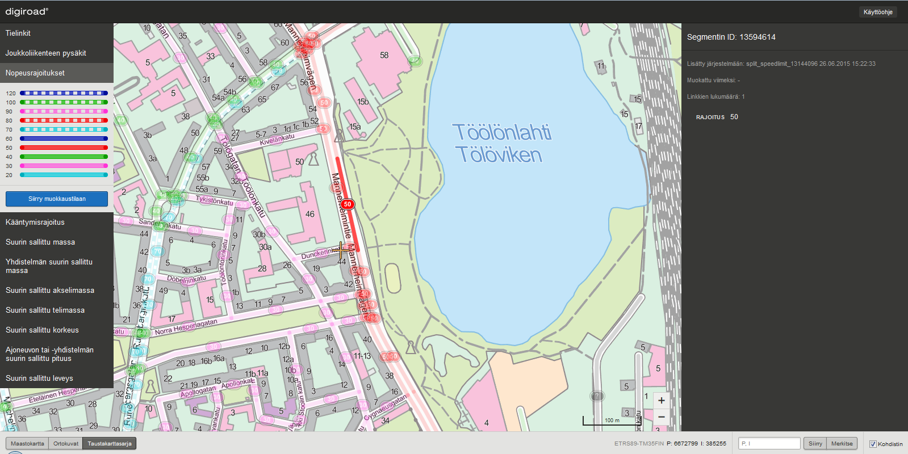

_Nopeusrajoituksen tietojen katselu, kun valittuna on yksitt&auml;inen nopeusrajoitus (tuplaklikkaus)._

###Nopeusrajoitusten visualisointi###

Nopeusrajoitukset on visualisoitu eri tavoin riippuen vaikutussuunnasta. Nopeusrajoituksen vaikutussuunta voi olla molempiin suuntiin tai vain toiseen suuntaan. Jos vaikutussuunta on molempiin suuntiin, nopeusrajoitus on visualisoitu yhdell&auml; paksulla viivalla (1). Yksisuuntainen vaikutus on visualisoitu ohuemmalla viivalla vaikutussuunnan mukaan tielinjan reunaan (2).

Digiroad-yll&auml;pitosovellus yhdist&auml;&auml; nopeusrajoitukset molempiin suuntiin voimassa olevaksi, jos tielinkill&auml; on vain yksinopeusrajoitus. K&auml;yt&auml;nn&ouml;ss&auml; siis kaikki tapaukset, joissa nopeusrajoituksen arvo molempiin suuntiin on sama, eik&auml; arvo vaihdu kesken tielinkin, visualisoidaan molempiin suuntiin voimassa olevana. Erityisesti risteysalueella nopeusrajoitukset voivat muuttua kesken tielinkin (2) tai rajoituksen arvo eri suuntiin on eri (2, 3), jolloin ne visualisoituvat yll&auml;pitosovelluksessa ohuemmilla viivoilla tiegeometrian viereen.

Nopeusrajoituksen muokkauksessa on mahdollisuus jakaa molempiin suuntiin voimassa oleva nopeusrajoitus yhteen suuntaan voimassa olevaksi.

_Nopeusrajoitusten visualisointi._

##Nopeusrajoituksien muokkaus##

Muokkaustilassa nopeusrajoituksille voi antaa uusia arvoja, niit&auml; voi katkaista sek&auml; muuttaa yksisuuntaisiksi. Nopeusrajoituksien arvoja voi muokata kolmella tavalla:

1. Koko nopeusrajoitusketjulle.
1. Yksitt&auml;isen linkin mittaiselle osuudelle.
1. Monivalinnan avulla kokonaiselle alueelle.

###Nopeusrajoituksen arvon muokkaus###

Muokattava nopeusrajoitus valitaan klikkaamalla sen geometriaa (4). Kerran klikkaamalla tulee valituksi koko nopeusrajoitusketju, eli kaikki nopeusrajoitukset, joilla on sama nopeusrajoituksen arvo ja tiennumero (maantiell&auml;) tai tien nimi (katuverkko ja yksityistie). 

Jos k&auml;ytt&auml;j&auml; haluaa valita vain yhden linkin mittaisen p&auml;tk&auml;n tarkasteluun, sen voi tehd&auml; tuplaklikkamalla nopeusrajoitusta.

Huom! Nopeusrajoituksien ketjuvalinta ei toimi yksisuuntaisille nopeusrajoituksille.

Tietoja muokataan ominaisuustieton&auml;kym&auml;ss&auml; valitsemalla nopeusrajoitukselle uusi arvo alasvetovalikosta (5). Muutokset tallennetaan painamalla Tallenna-painiketta. Ennen Tallenna-painikkeen painamista muutokset voi perua painamalla Peruuta-painiketta. Tallenna- ja peruuta –painikkeet eiv&auml;t ole aktiivisina, jos muutoksia ei ole tehty. Jos muutoksia on tehty eik&auml; niit&auml; ole peruttu tai tallennettu ja siirryt&auml;&auml;n muokkaamaan toista kohdetta tai pois auki olevan tietolajin muokkaustilasta, sovellus antaa muutos-dialogin, joka kertoo, ett&auml; muutoksia on tehty ja ne tulee tallentaa tai peruuttaa ennen kuin voi jatkaa.

_Nopeusrajoitusketjun arvon muokkaus (klikattu kerran)._

####Useamman nopeusrajoituksen arvon muokkaus kerralla####

Useamman kuin yhden nopeusrajoituksen arvon voi muuttaa kerralla. Halutut nopeusrajoitukset valitaan painamalla Ctrl-painike n&auml;pp&auml;imist&ouml;lt&auml; pohjaan ja piirt&auml;m&auml;ll&auml; hiirell&auml; laatikko nopeusrajoitusten p&auml;&auml;lle. Valituksi tulevat kaikki nopeusrajoitukset laatikon sis&auml;ll&auml; ja nopeusrajoitukset, joita laatikko leikkaa. Valinnan j&auml;lkeen avautuu ikkuna, jossa valitaan nopeusrajoituksille tallentuva arvo ja painetaan tallenna. Peruuta-painikkeesta voi perua muutoksen.

_Useamman nopeusrajoituksen arvon muokkaus kerralla._

####Nopeusrajoituksen katkaiseminen####

Nopeusrajoituksen voi jakaa kahteen osaan leikkausty&ouml;kalulla (13). Leikkausty&ouml;kalulla klikataan nopeusrajoituksen geometriasta kohtaa, josta nopeusrajoitus halutaan katkaista. Nopeusrajoituksen geometrian p&auml;&auml;ll&auml; ty&ouml;kalu n&auml;kyy ristin&auml;, jotta tarkka katkaisukohta on helppo m&auml;&auml;ritt&auml;&auml;.

Nopeusrajoituksen katkaisu valitsee aina vain linkin mittaisen osion nopeusrajoitusta, ei nopeusrajoitusketjua.

_Nopeusrajoituksen katkaiseminen._

Nopeusrajoituksen katkaisussa uusille rajoituksille valitaan arvot oikean laidan alasvetovalikoista (4). Kartalla ja alasvetovalikkojen vieress&auml; olevat kirjaimet osoittavat, kummasta rajoituksesta on kyse (5). Uudet nopeusrajoitukset tallennetaan tallenna-painikkeesta (6). Katkaisun voi peruuttaa peruuta-painikkeella (7), jolloin alkuper&auml;inen rajoitus j&auml;&auml; voimaan.

Huom! Nopeusrajoituksen katkaisussa tulee m&auml;&auml;ritt&auml;&auml; nopeusrajoituksille eri arvot, jotta tallennus on mahdollista.

###Nopeusrajoituksen muuttaminen yksisuuntaiseksi###

Molempiin suuntiin voimassa olevan nopeusrajoituksen voi muuttaa yksisuuntaiseksi, jos kyseisell&auml; tielinkill&auml; liikennevirran suunta on molempiin suuntiin. Muutos tehd&auml;&auml;n siis tielinkkikohtaisesti.

Muutos tehd&auml;&auml;n tuplaklikkaamalla kyseist&auml; nopeusrajoitusta (1), jolloin oikeaan laitaan tulee painike "Jaa nopeusrajoitus yksisuuntaiseksi" (2).

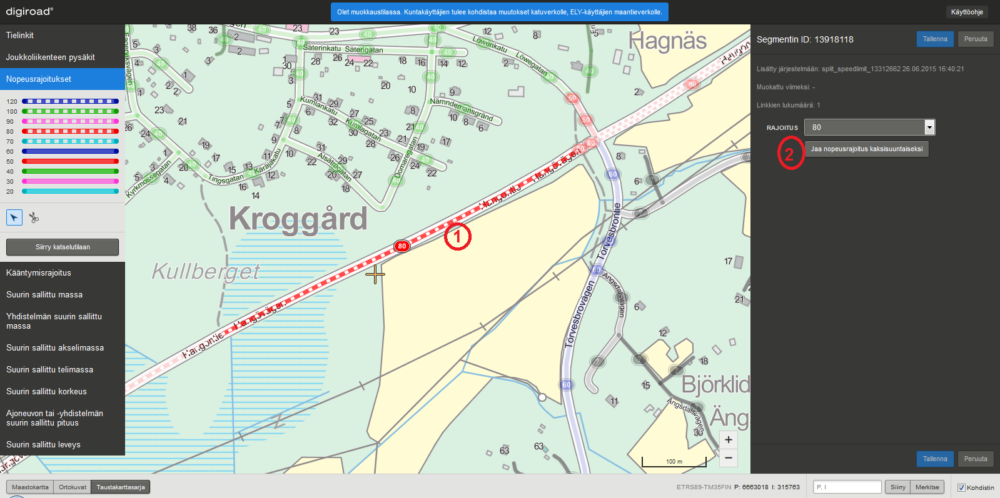

_Nopeusrajoituksen valinta ja muuttaminen yksisuuntaiseksi._

Painikkeen painamisen j&auml;lkeen voi uusille nopeusrajoituksille antaa arvot alasvetovalikoista (3). Kirjaimet alasvetovalikkojen vieress&auml; vastaavat nopeusrajoituksia kartalla (4). Arvojen pit&auml;&auml; erota toisistaan, jotta tallentaminen on mahdollista.

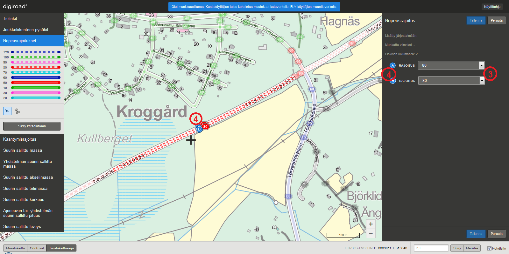

_Uusien yksisuuntaisten nopeusrajoitusten arvon valinta._

Uudet nopeusrajoitukset tallennetaan tallenna-painikkeesta. Jakamisen voi peruuttaa peruuta-painikkeella, jolloin alkuper&auml;inen rajoitus j&auml;&auml; voimaan.

Jos tallennuksen j&auml;lkeen yhteen suuntaan voimassa oleville nopeusrajoituksille antaa saman arvon, sovellus yhdist&auml;&auml; ne molempiin voimassa oleviksi.

###Tuntemattomat nopeusrajoitukset###

Jos nopeusrajoitus ko. linkill&auml; ei ole tiedossa, n&auml;kyy se k&auml;ytt&ouml;liittym&auml;ss&auml; mustana eli tuntemattomana nopeusrajoituksena. Tuntemattomia nopeusrajoituksia on kahdenlaisia:

1. Nopeusrajoitustieto on poistunut, kun alla olevan tielinkin geometria on p&auml;ivittynyt.
1. Nopeusrajoitustietoa ei ole koskaan toimitettu Digiroad-j&auml;rjestelm&auml;&auml;n.

Tuntemattomalle nopeusrajoitukselle voi antaa arvon alasvetovalikosta ja niit&auml; voi muokata my&ouml;s monivalintaty&ouml;kalun avulla. Tuntemattomia nopeusrajoituksia ei kuitenkaan voi katkaista katkaisuty&ouml;kalulla, eik&auml; niit&auml; voi jakaa yksisuuntaisiksi. Tuntemattomille nopeusrajoituksille tulee antaa ensin arvo, jotta niiden muokkaus t&auml;ydellisesti onnistuu.

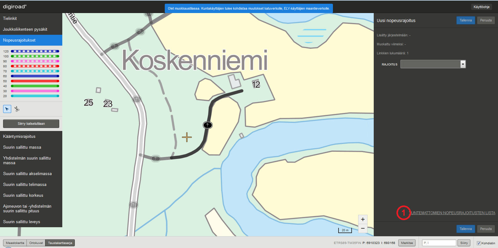

_Tuntematon nopeusrajoitus._

Tuntemattomista nopeusrajoituksista on lista, johon p&auml;&auml;see nopeusrajoitusten ominaisuustieton&auml;kym&auml;st&auml; (1). Nopeusrajoitukset on jaoteltu listalle kunnan sek&auml; kunnan sis&auml;ll&auml; hallinnollisen luokan (kunta, valtio, yksityinen) mukaan. Nopeusrajoituksesta on listassa linkki, josta p&auml;&auml;see suoraan nopeusrajoituksen kohdalle sovelluksessa ja sille voi asettaa arvon. Nopeusrajoituslinkin voi avata uuteen v&auml;lilehteen klikkaamalla linkki&auml; Ctrl-painike pohjassa. Muuten linkki avautuu samaan v&auml;lilehteen. Lista sulkeutuu Sulje lista -painikkeesta.

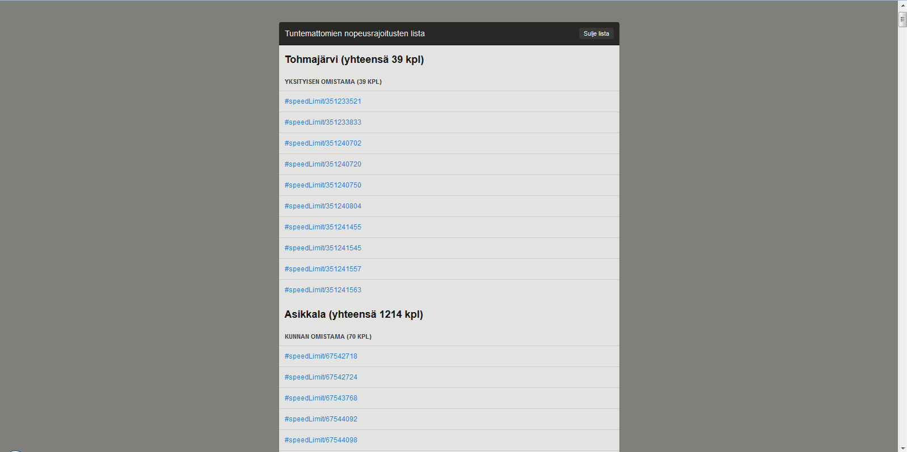

_Tuntemattomien nopeusrajoitusten lista._

6. K&auml;&auml;ntymisrajoitukset
----------------------------------

Kartalle voi valita k&auml;&auml;ntymisrajoitukset valitsemalla tietolajit-paletista (1) K&auml;&auml;ntymisrajoitus. Karttaa tarkennettaessa k&auml;&auml;ntymisrajoitukset paksuuntuvat, jotta niiden erottaminen olisi helpompaa. K&auml;&auml;ntymisrajoitukset on visualisoitu siten, ett&auml; linkki, jolta ei saa k&auml;&auml;nty&auml;, on sininen, ja linkki, jolle ei saa k&auml;&auml;nty&auml; on visualisoitu punaisella katkoviivalla. Visualisoinnin selitteet n&auml;kyv&auml;t K&auml;&auml;ntymisrajoitus-valinnan alla tietolajit-paletissa. Tielinkeill&auml;, joiden liikennevirran suunta on vain yhteen suuntaan, on visualisoitu suuntanuoli kuvaamaan liikennevirran suuntaa.

_K&auml;&auml;ntymisrajoitusten valinta._

##K&auml;&auml;ntymisrajoituksen tietojen katselu##

Yksitt&auml;isen k&auml;&auml;ntymisrajoituksen voi valita klikkaamalla kartalta sen geometriaa.  Valittu k&auml;&auml;ntymisrajoitus (4) korostuu kartalla ja sen ominaisuustiedot avautuvat ominaisuustieton&auml;kym&auml;&auml;n (6).

_K&auml;&auml;ntymisrajoituksen tietojen katselu._

##K&auml;&auml;ntymisrajoitusten muokkaus##

K&auml;&auml;ntymisrajoituksia muokataan muokkaustilassa. Muokattava kohde valitaan klikkaamalla sen geometriaa (4). Tietoja muokataan ominaisuustieton&auml;kym&auml;ss&auml; (6). Muokattavia tietoja ovat k&auml;&auml;ntymisrajoituksen kohdelinkit, ajoneuvotyypit, joita k&auml;&auml;ntymisrajoitus ei koske sek&auml; tarkenne (esim. aika). Ominaisuustieton&auml;kym&auml;ss&auml; on linkin yhteydess&auml; kartalla kohdelinkkej&auml; vastaavat kirjaimet helpottamassa oikean linkin valintaa (7). Poikkeukset (ajoneuvotyypit ja vapaa tekstikentt&auml;) n&auml;kyv&auml;t ainoastaan silloin, kun kyseinen tielinkki on valittu k&auml;&auml;ntymisrajoituksen kohdelinkiksi.

Muutokset tallennetaan painamalla Tallenna-painiketta (8). Ennen Tallenna-painikkeen painamista muutokset voi peruuttaa painamalla Peruuta-painiketta (9). Tallenna- ja Peruuta -painikkeet eiv&auml;t ole aktiivisina, jos muutoksia ei ole tehty. Jos muutoksia on tehty eik&auml; niit&auml; ole tallennettu tai peruutettu ja siirryt&auml;&auml;n pois k&auml;&auml;ntymisrajoituksen valinnasta, sovellus antaa muutos-dialogin. Muutos-dialogi kertoo k&auml;ytt&auml;j&auml;lle, ett&auml; muutoksia on tehty ja ne tulee tallentaa tai peruuttaa ennen kuin voi jatkaa.

_K&auml;&auml;ntymisrajoitusten muokkaus._

####Uuden k&auml;&auml;ntymisrajoituksen lis&auml;&auml;minen####

Uusi k&auml;&auml;ntymisrajoitus lis&auml;t&auml;&auml;n valitsemalla kartalta se tielinkki, joka on k&auml;&auml;ntymisrajoituksen l&auml;hde. Sivun oikeaan laitaan avautuu ominaisuustieton&auml;kym&auml; (6), jossa on n&auml;kyviss&auml; valitulta tielinkilt&auml; l&auml;htev&auml;t tielinkit, sek&auml; niit&auml; karttan&auml;kym&auml;ss&auml; vastaavat kirjaimet (7). Ominaisuustieton&auml;kym&auml;st&auml; valitaan ne tielinkit, joille valitulta tielinkilt&auml; ei saa k&auml;&auml;nty&auml;. Kun linkin valitsee, sen alapuolelle ilmestyy alasvetovalikko niiden ajoneuvojen valintaan, joita k&auml;&auml;ntymisrajoitus ei koske sek&auml; vapaa tekstikentt&auml;. Valitsemalla k&auml;&auml;ntymisrajoituksen kohde uusi k&auml;&auml;ntymisrajoitus visualisoituu kartalle. Kevyen liikenteen v&auml;ylille ei voi lis&auml;t&auml; k&auml;&auml;ntymisrajoitusta.
 
####Uuden k&auml;&auml;ntymisrajoituksen poistaminen####

K&auml;&auml;ntymisrajoituksen voi poistaa valitsemalla sen l&auml;hdelinkin kartalta. Ominaisuustieton&auml;kym&auml;&auml;n avautuu k&auml;&auml;ntymisrajoituksen kohteet. Poistamalla valinnan kaikista k&auml;&auml;ntymisrajoituksen kohteista ja tallentamalla, k&auml;&auml;ntymisrajoitus poistuu.

7. Suurin sallittu X 7
----------------------

Kartalle voi valita tietolajit-paletista (1) Suurin sallittu -valinnan. Karttaa tarkennettaessa geometriat paksuuntuvat, jotta niiden erottaminen on helpompaa. Geometriat on visualisoitu punaisella v&auml;rill&auml; ja tielinkit, joilla suurinta sallittua arvoa ei ole, on visualisoitu harmaalla v&auml;rill&auml;.

Suurin sallittu x7:

__Suurin sallittu massa__
__Yhdistelm&auml;n suurin sallittu massa__
__Suurin sallittu akselimassa__
__Suurin sallittu telimassa__
__Suurin sallittu korkeus__
__Ajoneuvon- tai yhdistelm&auml;n suurin sallittu pituus__
__Suurin sallittu leveys__

_Suurin sallittu -valinta._

##Suurin sallittu x7 tietojen katselu##

Yksitt&auml;isen suurin sallittu -kohteen voi valita klikkaamalla kartalta sen geometriaa (4). Geometria tummentuu ja muut geometriat n&auml;kyv&auml;t haaleammalla. Sivun oikeaan laitaan avautuu valitun kohteen ominaisuustieton&auml;kym&auml; (6).

_Suurin sallittu -katselutila._

##Suurin sallittu x7 ominaisuustietojen muokkaus##

Suurin sallittu -valintaa muokataan muokkaustilassa. Muokattava kohde valitaan klikkaamalla sen geometriaa (4). Tietoja muokataan ominaisuustieton&auml;kym&auml;ss&auml; (6). Muutokset tallennetaan painamalla Tallenna-painiketta oikeasta alakulmasta (8). Ennen Tallenna-painikkeen painamista muutokset voi peruuttaa painamalla Peruuta-painiketta (9). Tallenna- ja Peruuta -painikkeet eiv&auml;t ole aktiivisina, jos muutoksia ei ole tehty. Jos muutoksia on tehty eik&auml; niit&auml; ole tallennettu tai peruutettu ja siirryt&auml;&auml;n pois painorajoituksen valinnasta, sovellus antaa muutos-dialogin. Muutos-dialogi kertoo k&auml;ytt&auml;j&auml;lle, ett&auml; muutoksia on tehty ja ne tulee tallentaa tai peruuttaa ennen kuin voi jatkaa.

Huom! Rajoituksen arvokent&auml;ss&auml; muiden kuin numeroarvojen tallentaminen aiheuttaa virhetilanteita tallentuvissa rajoituksissa.

_Suurin sallittu -valinnan muokkaus._

####Suurin sallittu -kohteen katkaisu####

Rajoituksen voi jakaa kahteen osaan leikkausty&ouml;kalulla (1). Siten leikkausty&ouml;kalun avulla voi m&auml;&auml;ritell&auml; lyhyit&auml; rajoituksia poistamalla voimasta katkaisussa j&auml;ljelle j&auml;&auml;neit&auml; rajoituksia. Leikkausty&ouml;kalulla klikataan rajoituksen geometriasta kohtaa, josta rajoitus halutaan katkaista. Rajoituksen geometrian p&auml;&auml;ll&auml; ty&ouml;kalu n&auml;kyy ristin&auml;, jotta tarkka katkaisukohta on helppo m&auml;&auml;ritt&auml;&auml; (2). 

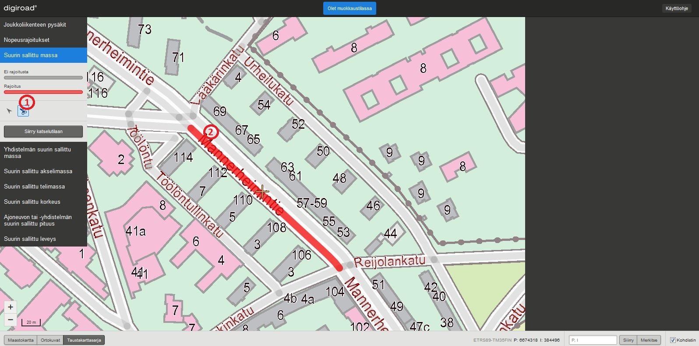

_Suurin sallittu -kohteen katkaisu._

Katkaistun rajoituksen osista pidemm&auml;lle j&auml;&auml; alkuper&auml;isen rajoituksen ID ja arvo. Lyhyempi osa tulee valituksi kartalla (4) ja sen ominaisuustiedot avautuvat ominaisuustieton&auml;kym&auml;&auml;n (6). Arvokentt&auml;&auml;n voi kirjata rajoitukselle uuden arvon, sen voi j&auml;tt&auml;&auml; ennalleen tai poistaa voimasta valitsemalla ”Ei rajoitusta”. Oletusarvona on sama rajoituksen arvo kuin alkuper&auml;isell&auml; rajoituksella. Uusi rajoitus tallennetaan Tallenna-painikkeesta (8). Tallentamisen j&auml;lkeen rajoitukselle generoidaan taustaj&auml;rjestelm&auml;ss&auml; ID. Ennen tallennusta rajoituksen katkaisemisen voi perua Peruuta-painikkeesta, joka palauttaa alkuper&auml;isen rajoituksen voimaan (9).

_Suurin sallittu -kohteen katkaisu._

####Suurin sallittu -kohteen poistaminen####

Tielinkin suurin sallittu -kohde poistetaan ominaisuustieton&auml;kym&auml;ss&auml; (6) valitsemalla Rajoitus-kohdasta "Ei rajoitusta".

_Suurin sallittu -kohteen poistaminen._

####Uuden suurin sallittu -kohteen lis&auml;&auml;minen####

Tielinkille voi lis&auml;t&auml; suurin sallittu -kohteen valitsemalla sen geometrian (4) Suurin sallittu -muokkaustilassa. Ominaisuustieton&auml;kym&auml;&auml;n (6) avautuu tielinkin suurin sallittu -kohteen tiedot. Valitaan "Rajoitus" ja sy&ouml;tet&auml;&auml;n suurin sallittu arvo sy&ouml;tekentt&auml;&auml;n. Suurin sallittu arvo tallennetaan painamalla Tallenna (8). Uuden suurin sallittu -kohteen lis&auml;&auml;misen voi perua Peruuta-painikkeella.

_Suurin sallittu -kohteen lis&auml;&auml;minen._
