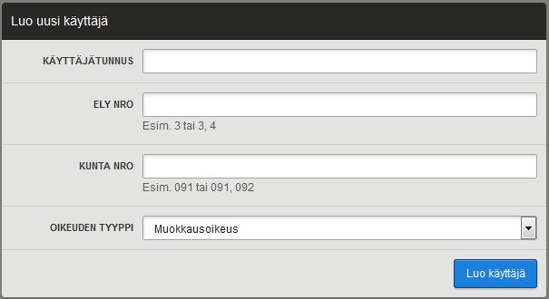
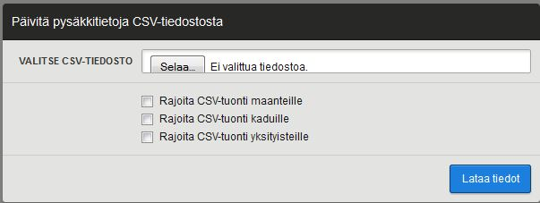
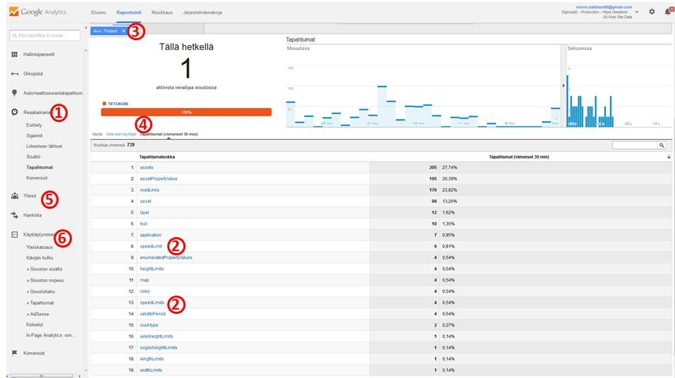

Operaattorin manuaali
=========================

1. Uuden k&auml;ytt&auml;j&auml;n lis&auml;&auml;minen
-----------------------------

Vain operaattori-k&auml;ytt&auml;j&auml; voi lis&auml;t&auml; uuden k&auml;ytt&auml;j&auml;n. Uusi k&auml;ytt&auml;j&auml; lis&auml;t&auml;&auml;n [k&auml;ytt&auml;j&auml;nhallinnassa.](https://testiextranet.liikennevirasto.fi/digiroad/newuser.html ) K&auml;ytt&auml;j&auml;nhallinnassa lis&auml;tyt k&auml;ytt&auml;j&auml;t ovat Premium-k&auml;ytt&auml;ji&auml;, joilla on oikeudet muokata m&auml;&auml;ritellyill&auml; alueilla kaikkia aineistoja.

K&auml;ytt&ouml;liittym&auml;ss&auml; on lomake, johon tulee t&auml;ydent&auml;&auml; seuraavat tiedot:

1. K&auml;ytt&auml;j&auml;tunnus: K&auml;ytt&auml;j&auml;n tunnus Liikenneviraston j&auml;rjestelmiin
1. Ely nro: ELY:n numero tai pilkulla erotettuna useamman ELY:n numerot (esimerkiksi 1, 2, 3)
1. Kunta nro: Kunnan numero tai pilkulla erotettuna useamman kunnan numerot (esimerkiksi 091, 092)
1. Oikeuden tyyppi: Muokkausoikeus tai Katseluoikeus

Kun lomake on t&auml;ytetty, painetaan "Luo k&auml;ytt&auml;j&auml;". Sovellus ilmoittaa onnistuneesta k&auml;ytt&auml;j&auml;n lis&auml;&auml;misest&auml;. Jos k&auml;ytt&auml;j&auml;ksi lis&auml;t&auml;&auml;n jo olemassa olevan k&auml;ytt&auml;j&auml;, sovellus poistaa vanhan ja korvaa sen uudella k&auml;ytt&auml;j&auml;ll&auml;. K&auml;ytt&auml;j&auml;n lis&auml;&auml;misest&auml; ei l&auml;hde automaattista viesti&auml; loppuk&auml;ytt&auml;j&auml;lle. Operaattorin tulee itse ilmoittaa k&auml;ytt&auml;j&auml;lle, kun k&auml;ytt&ouml;oikeus on luotu. T&auml;m&auml;n j&auml;lkeen k&auml;ytt&auml;j&auml; p&auml;&auml;see kirjautumaan Liikenneviraston tunnuksilla j&auml;rjestelm&auml;&auml;n.



_Uuden k&auml;ytt&auml;j&auml;n lis&auml;&auml;minen._

2. Importit
-----------

Importeilla tuodaan aineistoja j&auml;rjestelm&auml;&auml;n.

2.1 CSV-tuonti
--------------

Joukkoliikenteen pys&auml;kkien suomenkielist&auml; nime&auml;, ruotsinkielist&auml; nime&auml;, liikenn&ouml;intisuuntaa, yll&auml;pit&auml;j&auml;n tunnusta, LiVi-tunnusta, matkustajatunnusta, tyyppi&auml; ja varusteita voi p&auml;ivitt&auml;&auml; tuomalla .csv-tiedoston [k&auml;ytt&ouml;liittym&auml;n](https://testiextranet.liikennevirasto.fi/digiroad/excel_import.html ) kautta j&auml;rjestelm&auml;&auml;n. Oletusarvoisesti j&auml;rjestelm&auml; p&auml;ivitt&auml;&auml; kaikilla v&auml;yl&auml;tyypeill&auml; olevia pys&auml;kkej&auml;. P&auml;ivitett&auml;vi&auml; pys&auml;kkej&auml; voi rajata my&ouml;s sen mukaan, mill&auml; v&auml;yl&auml;tyypill&auml; ne sijaitsevat. Rajoitus tehd&auml;&auml;n valitsemalla k&auml;ytt&ouml;liittym&auml;st&auml; halutut v&auml;yl&auml;tyypit.



_K&auml;ytt&ouml;liittym&auml; .csv-tiedostojen tuonnille._

1. Klikkaa "selaa"
1. Etsi .csv-tiedosto hakemistostasi.
1. Klikkaa "Lataa tiedot"

Tietoja k&auml;sitelless&auml;&auml;n sovellus ilmoittaa:"Pys&auml;kkien lataus on k&auml;ynniss&auml;. P&auml;ivit&auml; sivu hetken kuluttua uudestaan". Kun sivun p&auml;ivitys onnistuu, sovellus on k&auml;sitellyt koko tiedoston.

Tuonnin onnistuessa j&auml;rjestelm&auml; ilmoittaa:"CSV tiedosto k&auml;sitelty". Mik&auml;li tuonti ep&auml;onnistuu, j&auml;rjestelm&auml; tulostaa virhelokin virheellisist&auml; tiedoista.

Huomioita csv-tiedostosta:

- .csv-tiedoston encoding-valinnan tulee olla "Encode in UTF-8 without BOM"
- Tiedoston tulee sis&auml;lt&auml;&auml; kaikki tietokent&auml;t, vaikka niit&auml; ei p&auml;ivitett&auml;isik&auml;&auml;n. Esimerkki:

```
Valtakunnallinen ID;Pys&auml;kin nimi;Pys&auml;kin nimi ruotsiksi;Tietojen yll&auml;pit&auml;j&auml;;Liikenn&ouml;intisuunta;Yll&auml;pit&auml;j&auml;n tunnus;LiVi-tunnus;Matkustajatunnus;Pys&auml;kin tyyppi;Aikataulu;Katos;Mainoskatos;Penkki;Py&ouml;r&auml;teline;S&auml;hk&ouml;inen aikataulun&auml;ytt&ouml;;Valaistus;Saattomahdollisuus henkil&ouml;autolla;Lis&auml;tiedot
165280;pys&auml;kin nimi;stops namn;1;etel&auml;&auml;n;HSL321;LIVI098;09876;2,4;1;2;1;99;2;1;2;1; Lis&auml;tietokentt&auml;&auml;n saa sy&ouml;tt&auml;&auml; vapaata teksti&auml;, joka saa sis&auml;lt&auml;&auml; merkkej&auml;(;:!(&), numeroita(1234) ja kirjaimia(AMSKD).
```
- Tiedot on eroteltu puolipisteell&auml; (;).
- Nimi suomeksi ja ruotsiksi, liikenn&ouml;intisuunta, yll&auml;pit&auml;j&auml;n tunnus, LiVi-tunnus ja matkustajatunnus luetaan merkkijonona.
- Tietojen yll&auml;pit&auml;j&auml; -kent&auml;n arvot ovat: (1) Kunta, (2) ELY-keskus, (3) Helsingin seudun liikenne, (99) Ei tiedossa.
- Pys&auml;kin tyypin arvot ovat: (1) Raitiovaunu, (2) Linja-autojen paikallisliikenne, (3) Linja-autojen kaukoliikenne, (4) Linja-autojen pikavuoro ja (5) Virtuaalipys&auml;kki.
- Pys&auml;kin tyypit on eroteltu pilkulla.
- Varusteet (aikataulu, katos, mainoskatos, penkki, py&ouml;r&auml;teline, s&auml;hk&ouml;inen aikataulun&auml;ytt&ouml;, valaistus ja saattomahdollisuus henkil&ouml;autolla) ilmoitetaan koodiarvoina: (1) Ei, (2) Kyll&auml; tai (99) Ei tietoa.
- Lis&auml;tiedot-kentt&auml;&auml;n voi tallentaa vapaata teksti&auml;, joka saa sis&auml;lt&auml;&auml; maksimissaan 4000 merkki&auml;. Huomioitavaa on, ett&auml; &auml;&auml;kk&ouml;set viev&auml;t kaksi merkki&auml;. Jos teksti sis&auml;lt&auml;&auml; puolipisteit&auml; (;) t&auml;ytyy teksti kirjoittaa lainausmerkkien("") sis&auml;&auml;n, jotta koko teksti tallentuu tietokantaan.
- Jos tietokent&auml;n j&auml;tt&auml;&auml; tyhj&auml;ksi, j&auml;&auml; pys&auml;kin vanha tieto voimaan.
- Toistaiseksi CSV-tuontia ei kannata tehd&auml; IE-selaimella, koska selain ei tulosta virhelokia.


3. Exportit
-----------

Exporteilla vied&auml;&auml;n aineistoja j&auml;rjestelm&auml;st&auml; ulos.

3.1 Pys&auml;kkitietojen vienti Vallu-j&auml;rjestelm&auml;&auml;n
---------------------------------------------

J&auml;rjestelm&auml; tukee pys&auml;kkitietojen vienti&auml; Vallu-j&auml;rjestelm&auml;&auml;n. Pys&auml;kkitiedot toimitetaan .csv-tiedostona FTP-palvelimelle. Vienti k&auml;ynnistet&auml;&auml;n automaattisesti Jenkins-palvelimella joka p&auml;iv&auml; klo 19:00 ajamalla 'vallu_import.sh' skripti. Skripti hakee pys&auml;kkitiedot tietokannasta k&auml;ytt&auml;en projektille m&auml;&auml;ritelty&auml; kohdetieto-tietol&auml;hdett&auml;.

FTP-yhteys ja kohdekansio tulee m&auml;&auml;ritell&auml; 'ftp.conf'-tiedostossa joka on tallennettu samaan 'vallu_import.sh' skriptin kanssa. 'ftp.conf'-tiedostossa yhteys ja kohdekansio m&auml;&auml;ritell&auml;&auml;n seuraavalla tavalla:
```
<k&auml;ytt&auml;j&auml;nimi> <salasana> <palvelin ja kohdehakemisto>
```

Esimerkiksi:
```
username password localhost/valluexport
```

Vienti luo FTP-palvelimelle pys&auml;kkitiedot zip-pakattuna .csv-tiedostona nimell&auml; 'digiroad_stops.zip' sek&auml; 'flag.txt'-tiedoston, joka sis&auml;lt&auml;&auml; Vallu-viennin aikaleiman muodossa vuosi (4 merkki&auml;), kuukausi (2 merkki&auml;), p&auml;iv&auml; (2 merkki&auml;), tunti (2 merkki&auml;), minuutti (2 merkki&auml;), sekunti (2 merkki&auml;). Esimerkiksi '20140417133227'.

K&auml;ytt&ouml;&ouml;notto kopioi ymp&auml;rist&ouml;kohtaisen 'ftp.conf'-tiedoston k&auml;ytt&ouml;&ouml;nottoymp&auml;rist&ouml;n deployment-hakemistosta release-hakemistoon osana k&auml;ytt&ouml;&ouml;nottoa. N&auml;in ymp&auml;rist&ouml;kohtaista 'ftp.conf'-tiedostoa, joka sis&auml;lt&auml;&auml; kirjautumistietoja, voidaan yll&auml;pit&auml;&auml; tietoturvallisesti k&auml;ytt&ouml;&ouml;nottopalvelimella. 

###Vallu CSV:n tietolajit###

|DR2 tietolaji|Vallu CSV|Kuvaus|
|-------------|---------|------|
|Valtakunnallinen tunnus| STOP_ID|PAKOLLINEN TIETO. Valtakunnallinen tunnus. Jos puuttuu niin Digiroad tuottaa omasta numeroavaruudesta.|
|Yll&auml;pit&auml;j&auml;n tunnus|ADMIN_STOP_ID| Yll&auml;pit&auml;j&auml;n tunnus|
|Matkustajatunnus|STOP_CODE|Pys&auml;kin ID matkustajalle|
|Nimi suomeksi| NAME_FI| Pys&auml;kin nimi suomeksi|
|Nimi ruotsiksi|NAME_SV|Pys&auml;kin nimi ruotsiksi|
|Maastokoordinaatti X|COORDINATE_X|Mitattu sijaintitieto: EUREF FIN ETRS89-TM35FIN|
|Maastokoordinaatti Y|COORDINATE_Y|Mitattu sijaintitieto: EUREF FIN ETRS89-TM35FIN|
|Pys&auml;kin osoite|ADRESS|Pys&auml;kin osoite|
|Tienumero|ROAD_NUMBER|Pys&auml;kin tien numero|
|Liikenn&ouml;intisuuntima|BEARING|Liikenn&ouml;intisuunta. Pohjoinen on nolla astetta, koko kierros my&ouml;t&auml;p&auml;iv&auml;&auml;n 360 astetta. Lasketaan importin yhteydess&auml; tiegeometriasta.|
|Liikenn&ouml;intisuuntiman kuvaus|BEARING_DESCRIPTION|Pohjoinen, koillinen, It&auml;, kaakko, etel&auml;, lounas, l&auml;nsi, luode|
|Liikenn&ouml;intisuunta|DIRECTION|Suunnan vapaampi sanallinen kuvaus|
|Tyyppi(kaukoliikenne)|EXPRESS_BUS|0 tai 1|
|Tyyppi(paikallisliikenne)|LOCAL_BUS|0 tai 1|
|Tyyppi(pikavuoro)|NON_STOP_EXPRESS_BUS|0 tai 1|
|Tyyppi(Virtuaalipys&auml;kki)|VIRTUAL_STOP|0 tai 1|
|Varusteet(Aikataulu)|Concatenoidaan EQUIPMENTSiin|1 - Ei, 2 - On, 99 - Ei tietoa|
|Varusteet(Katos)|Concatenoidaan EQUIPMENTSiin|1 - Ei, 2 - On, 99 - Ei tietoa|
|Varusteet(Mainoskatos)|Concatenoidaan EQUIPMENTSiin|1 - Ei, 2 - On, 99 - Ei tietoa|
|Varusteet(Penkki)|Concatenoidaan EQUIPMENTSiin|1 - Ei, 2 - On, 99 - Ei tietoa|
|Varusteet(Py&ouml;r&auml;teline)|Concatenoidaan EQUIPMENTSiin|1 - Ei, 2 - On, 99 - Ei tietoa|
|Varusteet(S&auml;hk&ouml;inen aikataulun&auml;ytt&ouml;)|Concatenoidaan EQUIPMENTSiin|1 - Ei, 2 - On, 99 - Ei tietoa|
|Varusteet(Valaistus)|Concatenoidaan EQUIPMENTSiin|1 - Ei, 2 - On, 99 - Ei tietoa|
|Saattomahdollisuus henkil&ouml;autolla|Concatenoidaan REACHABILITYyn|1 - Ei, 2 - On, 99 - Ei tietoa|
|Liitynt&auml;pys&auml;k&ouml;intipaikkojen m&auml;&auml;r&auml;|Concatenoidaan REACHABILITYyn|Liitynt&auml;pys&auml;k&ouml;intipaikkojen m&auml;&auml;r&auml;|
|Liitynt&auml;pys&auml;k&ouml;innin lis&auml;tiedot|Concatenoidaan REACHABILITYyn|Liitynt&auml;pys&auml;k&ouml;innin lis&auml;tiedot|
|Esteett&ouml;myys liikuntarajoitteiselle|SPECIAL_NEEDS|P&auml;&auml;sy py&ouml;r&auml;tuolilla|
|Muokattu viimeksi|MODIFIED_TIMESTAMP|Tiedon muokkaushetki|
|Muokattu viimeksi|MODIFIED_BY|Muokkaajan k&auml;ytt&auml;j&auml;tunnus|
|Ensimm&auml;inen voimassaolop&auml;iv&auml;|VALID_FROM|Pys&auml;kin ensimm&auml;inen voimassaolop&auml;iv&auml;|
|Viimeinen voimassaolop&auml;iv&auml;|VALID_TO|Pys&auml;kin viimeinen voimassaolop&auml;iv&auml;|
|Tietojen yll&auml;pit&auml;j&auml;|ADMINISTRATOR_CODE|Yll&auml;pit&auml;v&auml; viranomainen: 1 - Kunta, 2 - ELY-keskus, 3 - Toimivaltainen viranomainen, 4 - Liikennevirasto|
|Kuntanumero|MUNICIPALITY_CODE|Kuntanumero|
|Kunta|MUNICIPALITY_NAME|Kunnan nimi|
|Lis&auml;tiedot|COMMENTS|Julkiset kommentit|
|Palauteosoite|CONTACT_EMAILS|Yhteystiedot vihje-/muutostietojen toimittamiseksi|

###3.1.1 Pys&auml;kkimuutosten p&auml;ivitys Vallu-j&auml;rjestelm&auml;&auml;n###

Pys&auml;kin tietoja muokattaessa muutoksista l&auml;htee joka y&ouml; Vallu-j&auml;rjestelm&auml;&auml;n XML-sanoma, jossa ovat muutettujen pys&auml;kkien tiedot.

Muuttuneita tietoja voi tarkastella lokista: https://devtest.liikennevirasto.fi/digiroad/vallu-server.log 


### 3.1.2 XML- viestin l&auml;hetys VALLUun###

Tallentamisen yhteydess&auml; l&auml;hetet&auml;&auml;n VALLU- j&auml;rjestelm&auml;&auml;n xml- viesti.

Vallu l&auml;hetyksen konfiguraatio on ./conf/[ymp&auml;rist&ouml;]/digiroad2.properties tiedostossa.
```
digiroad2.vallu.server.sending_enabled=true
digiroad2.vallu.server.address=http://localhost:9002
```
L&auml;hetettyjen tietojen logitiedot l&ouml;tyv&auml;t palvelimelta ./logs/vallu-messages.log tiedostosta.


3.2 Pys&auml;kkitietojen vienti LMJ-j&auml;rjestelm&auml;&auml;n
---------------------------------------------------------------

Pys&auml;keist&auml; voi irroittaa kuntarajauksella .txt-tiedostoja LMJ-j&auml;rjestelm&auml;&auml; varten. Irroitusta varten t&auml;ytyy olla kehitysymp&auml;rist&ouml; ladattuna koneelle.

Tarvittavat tiedostot ovat bonecp.properties ja LMJ-import.sh -skripti. Bonecp.properties ei ole avointa l&auml;hdekoodia eli sit&auml; ei voi julkaista GitHubissa eik&auml; siten t&auml;ss&auml; k&auml;ytt&ouml;ohjeessa. Tarvittaessa tiedostoa voi kysy&auml; digiroad2@reaktor.fi. Bonecp.properties tallennetaan sijaintiin:

```
digi-road-2\digiroad2-oracle\conf\properties\
```

Kun bonecp.properties on tallennettu, voidaan LMJ-import.sh-skripti ajaa Linux-ymp&auml;rist&ouml;ss&auml; komentorivill&auml;. Jos k&auml;yt&ouml;ss&auml; on Windows-ymp&auml;rist&ouml;, skriptin&auml; ajetaan:

```
sbt -Ddigiroad2.env=production "runMain fi.liikennevirasto.digiroad2.util.LMJImport <kuntanumerot v&auml;lill&auml; erotettuna>"
```

Esimerkiksi:
```
 sbt -Ddigiroad2.env=production "runMain fi.liikennevirasto.digiroad2.util.LMJImport 89 90 91"
```
 
Sovellus luo Stops.txt-tiedoston samaan hakemistoon LMJ_import.sh-skriptin kanssa.

4. Kehitysymp&auml;rist&ouml;n asennus
----------------------------

__Projekti GitHubissa__

Projektin kloonaaminen omalle koneelle edellytt&auml;&auml; tunnuksia [GitHubiin](https://github.com/), jossa versionhallinta toteutetaan. Lis&auml;ksi tarvitaan [Git client](http://git-scm.com/downloads) omalle koneelle. Client on k&auml;ytt&ouml;liittym&auml;, joita on olemassa sek&auml; graafisia ett&auml; komentorivipohjaisia. 

Projektin kloonaaminen suoritetaan clientilla. Ensimm&auml;ist&auml; kertaa clienttia k&auml;ytett&auml;ess&auml; suoritetaan seuraavat komennot (komentorivipohjaisissa clienteissa):

M&auml;&auml;ritell&auml;&auml;n nimimerkki, joka n&auml;kyy, kun commitoi uutta koodia GitHubiin. K&auml;yt&auml;nn&ouml;ss&auml; operaattorin ei tarvitse commitoida.

```
git config --global user.name "Nimimerkkisi"
```

Kloonataan projekti omalle koneelle.

```
git clone https://github.com/finnishtransportagency/digi-road-2.git
```

__Kehitysymp&auml;rist&ouml;__

- Asenna [node.js](http://howtonode.org/how-to-install-nodejs) (samalla asentuu npm).

- Asenna bower. Ajetaan komentorivill&auml; komento:

```
npm install -g bower
```

- Hae ja asenna projektin tarvitsemat riippuvuudet:

```
npm install && bower install
```

- Asenna grunt:

```
npm install -g grunt-cli
```

- Alusta ja konfiguroi tietokantaymp&auml;rist&ouml;. Luo tiedosto bonecp.properties sijaintiin: digiroad2/digiroad2-oracle/conf/dev/bonecp.properties. Bonecp.properties sis&auml;lt&auml;&auml; tietokantayhteyden tiedot:

```
bonecp.jdbcUrl=jdbc:oracle:thin:@<tietokannan_osoite>:<portti>/<skeeman_nimi>
bonecp.username=<k&auml;ytt&auml;j&auml;tunnus>
bonecp.password=<salasana>
```

Tietokantayhteyden tiedoista voi kysy&auml; Taru Vainikaiselta.

Tietokanta ja skeema t&auml;ytyy alustaa aika ajoin (huomaa, kun kehitysymp&auml;rist&ouml; ei en&auml;&auml; toimi). Alustus suoritetaan ajamalla fixture-reset.sh-skripti komentorivill&auml;:

```
fixture-reset.sh
```

__Kehitysymp&auml;rist&ouml;n ajaminen__

Kehitysymp&auml;rist&ouml;&auml; ajetaan koneella ajamalla seuraavat komennot aina, kun kehitysymp&auml;rist&ouml; k&auml;ynnistet&auml;&auml;n uudelleen:

Kehitysserverin pystytys:

```
grunt server
```

API-palvelin:

__Windows:__

```
sbt
```

```
container:start
```

__Linux:__

```
./sbt '~;container:start /'
```

5. Radiator
-----------

[Radiatorista](https://livi-ci.reaktor.fi/user/liikenne/my-views/view/Radiator/) voi seurata sovelluksen buildit, uuden version viennit eri ymp&auml;rist&ouml;ihin, ovatko ymp&auml;rist&ouml;t pystyss&auml; ja Vallu CSV-exportin onnistumisen sek&auml; siihen k&auml;ytetyn ajan.

Buildeja p&auml;&auml;see katsomaan DR2-build -laatikosta. Deploy to "stagu" -laatikko kertoo uuden version viennist&auml; testiymp&auml;rist&ouml;&ouml;n, Deploy to production -laatikko tuotantoymp&auml;rist&ouml;&ouml;n viennist&auml; ja Deploy to training -laatikko koulutusymp&auml;rist&ouml;&ouml;n viennist&auml;. Vallu export -laatikosta p&auml;&auml;see katsomaan Vallu CSV-exportin onnistumista sek&auml; siihen kulunutta aikaa.

Deploy to "stagu"-, Deploy to production- ja Deploy to training -laatikot ovat vihrein&auml;, mik&auml;li ko. laatikon ymp&auml;rist&ouml; on pystyss&auml;. DR2-build- ja Vallu export -laatikot ovat vihrein&auml;, mik&auml;li buildi tai export on onnistunut. Laatikoiden oikeassa alakulmassa oleva aika kertoo viimeisimm&auml;n suorituksen keston. Kun suoritus on kesken, laatikossa n&auml;kyy vaalean vihre&auml; palkki, joka kuvaa suoritusta.
 
Radiaattoriin tarvitsee k&auml;ytt&auml;j&auml;tunnuksen. K&auml;ytt&auml;j&auml;tunnusta voi kysy&auml; kehitystiimilt&auml;: digiroad2@reaktor.fi.

6. DR2:n Google-tili
--------------------

Digiroad 2:lla on oma Google-tili: Digiroad2@gmail.com. Tili on edellytys, jotta Google Streetview:ll&auml; on mahdollista ladata muutama tuhat kuvaa p&auml;iv&auml;ss&auml;. My&ouml;s Digiroad 2:den Google Driven omistajuus on ko. tilill&auml;.

Tunnuksia Google-tiliin voi kysy&auml; kehitystiimilt&auml;: digiroad2@reaktor.fi.

7. Google Analytics
-------------------

Digiroad2-sovellus ja siihen liittyv&auml;t sivustot (mm. floating stops ja k&auml;ytt&ouml;ohje) on kytketty [Google Analyticsiin](https://www.google.com/analytics/) . Google Analyticsin avulla voi seurata sovelluksen k&auml;ytt&ouml;&auml; ja k&auml;ytt&auml;j&auml;m&auml;&auml;ri&auml;. Google Analyticsi&auml; p&auml;&auml;see katsomaan Digiroadin omilla gmail-tunnuksilla digiroad.ch5@gmail.com (salasana operaattorilta) tai digiroad2@gmail.com (salasana kehitystiimilt&auml;).

Google Analyticsiin on kytketty kaikki Digiroad2:sen ymp&auml;rist&ouml;t:

-	Production: tuotantokanta, osoite selaimessa testiextranet -alkuinen
-	Staging: testikanta, osoite selaimessa devtest -alkuinen
-	Training: koulutuskanta, osoite selaimessa apptest –alkuinen

Kunkin ymp&auml;rist&ouml;n tilastoihin p&auml;&auml;see k&auml;siksi painamalla sen alta kohtaa ”All Web Site Data”. Ymp&auml;rist&ouml;n valinnan j&auml;lkeen vasemman laidan valikoista voi tarkastella joko reaaliaikaista tilannetta (viimeiset 30 min) tai aiempaa tilannetta joltain aikav&auml;lilt&auml;. Aikav&auml;li&auml; voi muokata oikeasta yl&auml;kulmasta p&auml;iv&auml;m&auml;&auml;r&auml;n tarkkuudella. T&auml;ss&auml; on esitelty muutamia tapoja hy&ouml;dynt&auml;&auml; Google Analyticsi&auml;, mutta eri valikoista l&ouml;yt&auml;&auml; my&ouml;s paljon muita tietoja.

Reaaliaikaisen tilanteen n&auml;kee Reaaliaikainen-valikosta (1). T&auml;&auml;lt&auml; voi tarkastella sek&auml; k&auml;ytt&auml;jien sijainteja ett&auml; tapahtumia. Tapahtumissa Tapahtumaluokka –sarakkeen alta voi klikata tietolajikohtaisesti, mit&auml; ko. tietolajiin kohdistuvia tapahtumia on juuri nyt katselun tai muokkauksen kohteena sovelluksessa. Tietolajia voi klikata erikseen (esim. speedLimit), jolloin p&auml;&auml;see katsomaan, paljonko kyseiseen tietolajiin kohdistuu tapahtumia. Tietolajikohtaisesti on huomioitava, ett&auml; s-p&auml;&auml;tteinen versio (speedLimits, assets, axleWeightLimits yms.) n&auml;ytt&auml;&auml; ruudulle haettujen kohteiden tapahtumat ja tietolajin alta ilman s-kirjainta (speedLimit, asset, axleWeightLimit yms.) l&ouml;yt&auml;&auml; muokkauksen, tallennuksen, siirtojen, uusien luomisen yms. tapahtumat (2). Valinnat voi tyhjent&auml;&auml; ruksista yl&auml;reunasta (3). Tapahtumia voi tarkastella k&auml;ytt&auml;jien lukum&auml;&auml;r&auml;n mukaan tai tapahtumien lukum&auml;&auml;r&auml;n mukaan (4).



Yleis&ouml;-valikon (5) Yleiskatsaus-kohdasta voi katsoa esimerkiksi kaupunkikohtaisia k&auml;vij&auml;m&auml;&auml;ri&auml; (7) ja selaintietoja kohdasta J&auml;rjestelm&auml; (8). N&auml;ist&auml; l&ouml;yt&auml;&auml; my&ouml;s tarkempia tietoja vasemman laidan valikosta kohdasta Maantieteelliset ja selaintiedoista kohdasta Teknologia. 


K&auml;ytt&auml;ytyminen-valikon (6) Yleiskatsaus-kohdasta voi katsoa eri Digiroad2-sovellukseen liittyvien sivujen avauskertoja osoitekohtaisesti tai sivun otsikon mukaan (9). Vasemman laidan valikosta kohdasta Tapahtumat voi katsoa tietyn aikav&auml;lin kymmenen yleisint&auml; tapahtumaa. Rajaamalla aikaikkunaa oikeasta yl&auml;kulmasta n&auml;kee my&ouml;s esimerkiksi tietyn viikon yleisimm&auml;t tapahtumat.


Linkit:
------

[Loppuk&auml;ytt&auml;j&auml;n ohje](https://testiextranet.liikennevirasto.fi/digiroad/manual)
 
[L&auml;hdekoodi](https://github.com/finnishtransportagency/digiroad2)


Yhteystiedot
------------

__Digiroadin kehitystiimi:__

digiroad2@reaktor.fi

__Palaute operaattorin manuaalista:__

taru.vainikainen@karttakeskus.fi
